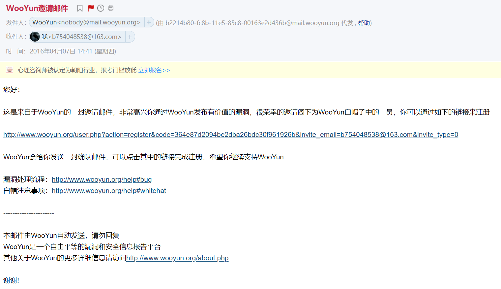

小事 · 一年前端记录

一些小事。

### 上山

五年前，我还是一个十几岁的毛头小子，人总要有点盼头才能过的下去，从高中退学的我开始寻找点什么，让自己有点未来，有点期待。不知道是孕妇效应的影响还是确实如此，我总觉得那段时间的“黑客”特别的多，在闲暇之余我开始寻找有关“黑客”的内容。

看雪论坛，红客，FreeBuf，乌云...都是我常去的论坛，尤其是乌云上的白帽子们更是让我憧憬无比，拿着笔记本，对着某个网站捣鼓捣鼓就能挖到0Day漏洞，提交过去之后厂商会确认给你打Rank值，Rank值可以以1:10的比例提现，这简直太酷太酷了。我谨记着“只有其他黑客承认你是个黑客时你才是个黑客”的名言，做着总有一天拿到乌云账号得梦，毕竟里面全都是挖过漏洞的白帽子。

是的，乌云需要“入场券”才可以注册，这个入场券是提交一个漏洞被厂商确认之后如果没有注册，乌云会给你的邮箱发一封邀请注册的邮件。

我翻着从图书馆借来的一本SQL Server的书，想着我看完这本书就能挖一些SQL漏洞了，表，列，SELECT，INSERT结合就能插入一条管理员账号，输入框里写双引号就能引起注入，用UNION可以得到原本的管理员账号，用chr结合报错信息可以枚举出存不存在这一个密码，得到的密码是MD5加密的，要去找彩虹表解....我带着这些问题去看这本书，很可惜并没有得到任何答案，他只是在教你建立一个数据库，如何查询数据，插入数据，鹅且还不是流行的MySql，我觉得我不需要学这些东西，我要学的SQL注入，不是SQL。此时的我并不知道知彼知己才能百战不殆，不会写又怎能知道它的漏洞呢。

数个不眠之夜后，我放弃了挖SQL注入漏洞的想法，转而去网站挂马，有很多有漏洞的小网站，当时ASP，PHP，JSP还是主流，近些年已经看不见ASP，JSP的网站，PHP还依然坚挺。

这些语言的网站有个特点就是可以写“一句话木马”，当时觉得非常厉害，因为是“木马”并且只有“一句话”，短小精悍。后来会编程之后发现只是eval接收POST或者GET的参数执行相应的代码，精髓在于结合一些混淆绕过安全检查程序和接收参数之后做的事情。利用这个一句话木马基本就得到了整个网站的控制权，对于脚本小子来说有相当的成就感，不过随之而来的很容易就到达了瓶颈，于是我开始想我是不是应该去学一学编程。

在作为脚本小子期间，我利用Windows的批处理写了一些脚本，虽然很难把批处理称为编程语言，不过我确实习得了编程的一些基础概念--变量，循环，控制语句。这时我在一篇渗透工程师入门的培训网站上看到教程大纲里写着建议学习的三门编程语言有Perl, Python和PHP，又恰逢Python的培训铺天盖地，于是在三选一中选择了Python。

Python的学习之路意外的通畅，跟着小甲鱼老师的Python课程学起来轻松很多，几个月之后在鱼C论坛上当上了Python板块的实习版主，给在Python讨论区提问题的人解答问题，同时输出一定的文章。因为我并不是一个Python的大师所以给别人解决问题的同时我自己也在学习，因为有个“版主”这个名誉上的责任，我要给别人把问题讲的明白就要自己先把问题搞懂，这期间实力“飞速增长”，很快又达到了一个瓶颈。

学习Python的本来目的是为了可以挖漏洞，但是学完Python之后...我发现我只会Python，Python不能直接用来挖漏洞，Python的语法也不能给我提供任何帮助。

踌躇之间，爬虫这个东西悄无声息的火了起来，利用作为脚本小子时积累到的抓包经验，我开始了解HTTP，了解HTML结构，用User-Agent，Referrer伪装成浏览器欺骗服务器，为了更快的爬取各种网站上的小姐姐又学习到了多线程，又因为Python中GIL(全局解释器锁)的限制，去了解了进程与线程概念，I/O密集型可以用线程，想用多核来计算需要用到进程(仅对Python而言)...

无法利用多核的多线程或许是个非常鸡肋的存在并且存在切换线程的消耗以及锁操作，Python在3.5版本后开始转向异步，后来在3.6得到确认正式加入`async/await`语法，这一点和JavaScript中的异步在语法上已经一致。做个类比的话，Python3.5中利用生成器暂停的特性+线程+事件循环提供的版本(或许不能链式回调记不清了)相当于Js中Promise(Promise中的内容并未开启新线程)在后来给我提供了一些理解上的便利。

在学习爬虫期间得到了我的第一桶金，是在某八戒上接到的一个爬取百度搜索后提取结果链接以及标题的项目，需求比较容易难点在把Python程序打包成exe，尝试各种打包工具后使用了Pyinstaller，折腾Pyinstaller的结果是后来在使用过程中发现了一个几乎没有影响的BUG，用蹩脚的英语提了人生第一个[Issue](https://github.com/pyinstaller/pyinstaller/issues/2826)。

喔对，在这期间我学习了PyQt5，某次浏览开源中国时发现了最初版本的[FeelUOwn](https://github.com/feeluown/FeelUOwn)，网抑云还远没有现在被各种模仿，很久以后我也模仿了一遍网抑云，日积月累以及各种蹭回复过程中得到了我第一个过千Star项目，这个写桌面的库内部支持一些HTML并且内置的样式表QSS是个CSS低配版，这让我后来学习CSS有了一些基础。同时还有利用PyQt5得到的第二三四五桶金，并且并没有给Qt打钱(逃~)。

爬虫与PyQt5中学到的HTML和乌云产生了一次碰撞。httponly还是凤毛麟角，JWT更是闻所未闻(指我自己= =...)的时候，利用插入的Js脚本偷取Cookies相对来说比SQL更加简单。在一个扇贝记单词的午后，思考人生之余，扇贝的打卡日记区域向我打开的大门，扇贝的过滤规则只生效了一次，多次尝试之后`<<!-- -->script<!-- -->>`会被过滤为`<script>`，这样就形成了一个持久型XSS，兴奋之余立马去乌云提交这个漏洞，无奈被标记为不需要处理的漏洞，因为httponly的属性并不能偷到有用信息且难以被人触发，但幸运女神在那天眷顾了我数次，扇贝更新旧密码的逻辑也有一个鸡肋的BUG，旧密码的验证使用的可控传参user_id，而新密码的更新却用的sessionid，我只需要用我自己的账号和旧密码做验证就可以替换sessionid的密码。理论上我并不可能得到别人的sessionid...但幸运就幸运在，与之前的鸡肋XSS结合正好可以在不用偷sessionid的情况下修改密码。

扇贝定的危险等级高，RANK值是10，但乌云给扇贝定义为小厂所以10RANK不奏效，按等级高给了4个(逃~)，在之后的三个月里陆陆续续挖到一些XSS，10RANK换了一件乌云T恤(说真的质量还挺差= =...)后乌云就升级中了。

### 历练

17年末，我尝试找一份实习的工作，投了一份“爬虫工程师”的意向，面试过程很顺利，只是几个正则提炼与抓包分析无任何加密的API的笔试以及问了一些线程异步相关的内容。所有一切都谈的很好，但...写简历时必填的学校字段我随意填了一个，HR让我带学生证过去，我没有啊，所以他很生气，郑重得和我说我填的一切都应该是真实的，不应该骗人。我也觉得我确实做了一件错误的事情，我第一次感觉到欺骗人的滋味，觉得心里的诚实三角在划动，让我感到窒息，后来发送邮件道歉，没有得到回信，对不起。

在那之后的很长一段时间都没有继续。18年初我开始花在编程上较多的时间，创造的过程对我来说感觉挺有趣。我开始增进自己的一些技能，找一些没有人翻译的英文文档来练习英语翻译，建立仓库存放，在Github发布后慢慢积累了一百多个Star，虽然翻译的内容比机翻强不了太多但也给了我极大的鼓励，在我至今的英语学习之路上开了一个挺好的头。上面提到的网抑云开始于现在，维护了一段时间后PyQt渐渐的放弃了。那时似乎兴起了一段刷题热，每天都能看到刷了几百道题进了XX大厂的帖子，于是功利的开始在LeetCode上刷题，刷题带来了编程与非编程上的结果都出乎意料，一方面在写代码的之前只要按照算法的思考过程建立起大体方向确定整体关键点写出来的代码debug次数明显减少，另一方面刷题的仓库成了第二个过千Star的项目，同时也因为这个会有一些编程前辈断断续续向我发一些内推邮件，其实我菜的真实。

之后开始了一份兼职，内容是维护网站，接触到了一个网站从域名购买备案解析到显示出页面的一整套流程，创造花里胡哨的页面带来的成就感让我感觉良好，SQL注入的传说终究只是个传说。前端的大门正式被推开，Vue, React, Angular三座大山映入眼帘，似乎一切又回到了四年前的那个下午，我知道这次是一个机会，一个让我真正入门的机会。

Vue新手友好的特性促使我首先学习加上Vue让我感觉有一些PyQt的影子，折腾起来并不费劲，JavaScript并没有花太多时间学习就上手了，得益于Python的融会贯通，或许大部分脚本语言都是同样的(说的就是你PHP)。

Vue的渐进特性让我学习起来也是渐进的，模仿一个成熟的项目是一个很好的学习方式。我开始模仿实验楼，选择实验楼一方面网抑云实在被模仿烂了，自身也没设计头脑做不了“全网最好看的第三方xxx”这样的创新，另一方面意外收到一封实验楼的邮件，内容说可以来成为作者之类的，不过当时确实什么也不会。

得益于CSS所见即所得的特性，常用的flex布局，svg配合font的icon，动画，过渡，画三角轮播等基础的样式都得以实践，所有基础属性几乎都用了一个遍，算是入了CSS的门，剩下的大概只有积累踩坑和新奇的特性。

Vue全家桶，webpack也全都打了个照面，最终整个项目用默认的打包进行的打包后，利用Github Pages(因为支持自定义域名)进行的部署完整“上线"，这样一个完整的前后端项目在跌跌撞撞中得以完成。

在[V2EX](https://www.v2ex.com/t/602088#reply37)上前辈的给建立的信心中我投了一份简历，顺利入职了前端，呼~。

### 江湖

入职后，前几周写代码时总会担心自己这里写的行不行，那里有没有符合标准，分配给我的需求能不能按时完成，分配的需求到底会不会做...这样的提心吊胆的日子持续了一个冬天...好在Leader人很好遇到的问题都给详细解答，Vue越写越熟练，对待产品测试不再唯唯诺诺(误~)。

疫情的突如其来让第一个假期格外的长，让我又停了下来，或许我应该做些规划。