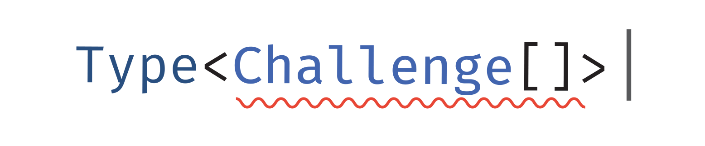

typescript 拾遗 ———— 类型体操挑战（一）



# 前言

最近翻到了一个集合了很多 Ts 类型挑战的[仓库](https://github.com/type-challenges/type-challenges)兴奋之余发现大部分都不能很好的写出来，与日常写的 Ts 类型有很大的不同，这项训练更加偏向于精进我们的 Ts 技术。

Ts 的浪潮已然席卷，趁着此时夯实一下 Ts 基础再好不过，话不多说直接开整。

除了常规的给出挑战及答案，本文中还包含一些自己的思考轨迹与论证过程，以及稍微编排了一下挑战顺序，更加由浅入深。仓库内本身包含答案，但总是缺少解释，这里写一下自己的思路~，希望可以少走一些路~。

# 开始挑战

## Hello World

[Take the Challenge](https://tsch.js.org/13/play/zh-CN)

```ts
// 期望是一个 string 类型
type HelloWorld = any;
```

<details>
<summary>查看答案：</summary>

```ts
type HelloWorld = string;
```

</details>

作为 Ts 的基础关键字 `type` ，可以用来声明一个类型，除了我们熟知的`string/boolean/number/array`等常规类型还可以声明[联合类型](https://www.typescriptlang.org/docs/handbook/2/everyday-types.html#union-types)如`string | number`，接受泛型`type HelloWorld<T> = T`。

泛型等知识在日常写类型与后续的挑战中经常用到，如果不太了解泛型可以先读一下[官方文档](https://www.typescriptlang.org/docs/handbook/2/generics.html#working-with-generic-type-variables)。

## If

[Take the Challenge](https://tsch.js.org/268/play/zh-CN)

实现一个 IF 类型，它接收一个条件类型 C ，一个判断为真时的返回类型 T ，以及一个判断为假时的返回类型 F。 C 只能是 true 或者 false， T 和 F 可以是任意类型。

<details>
<summary>查看答案：</summary>

```ts
type If<C extends boolean, T, F> = C extends true ? T : F;
```

</details>

Ts 中常规的[条件判断](https://www.typescriptlang.org/docs/handbook/2/conditional-types.html)一般都用`extends xxx`(写在泛型中一般可以将 extends 关键字理解为收窄类型)来进行，同时支持三目运算符来输出结果。

## Pick

[Take the Challenge](https://tsch.js.org/4/play/zh-CN)

```
实现 TS 内置的 Pick<T, K>，但不可以使用它。

从类型 T 中选择出属性 K，构造成一个新的类型。

例如：

interface Todo {
  title: string
  description: string
  completed: boolean
}

type TodoPreview = MyPick<Todo, 'title' | 'completed'>

const todo: TodoPreview = {
    title: 'Clean room',
    completed: false,
}
```

<details>
<summary>查看答案：</summary>

```ts
1;
type MyPick<T, K extends keyof T> = { [Ke in K]: T[Ke] };

2;
type MyPick<T, K> = { [Ke in keyof T as Ke extends K ? Ke : never]: T[Ke] };
```

</details>

实现`Pick`的思路并不难想，遍历给定的 T 的 key，如果此 key 存在于 K 类型中则添加到返回的类型中。

基于上面的思路我们很快想到 Ts 中可以用 `{ [K in keyof T]: T[K] }` 的形式来进行遍历，keyof 关键字的返回也是一个[联合类型](https://www.typescriptlang.org/docs/handbook/2/keyof-types.html#handbook-content)，那我们直接遍历需要 Pick 的属性就好了，同样都是联合类型：`type MyPick<T, K> = { [Ke in K]: T[Ke] }`。这时你可能会想到如果我传入的 K 不存在于 T 中，那岂不是会生成错误的值（实际上 TS 已经帮我们检查了）。要解决这个问题我们给 K 限定一下传入的 key 必须是存在于 T 中的就可以了，`type MyPick<T, K extends keyof T> = { [Ke in K]: T[Ke] }`，或者我们在`[Ke in keyof T as Ke extends K ? Ke : never]`遍历时将某些 key 设为`never`也可以。

## Readonly

[Take the Challenge](https://tsch.js.org/7/play/zh-CN)

```
不使用内置的Readonly<T>，自己实现一个。

该 Readonly 会接收一个 泛型参数，并返回一个完全一样的类型，只是所有属性都会被 readonly 所修饰。

也就是不可以再对该对象的属性赋值。

例如：

interface Todo {
  title: string
  description: string
}

const todo: MyReadonly<Todo> = {
  title: "Hey",
  description: "foobar"
}

todo.title = "Hello" // Error: cannot reassign a readonly property
todo.description = "barFoo" // Error: cannot reassign a readonly property
```

<details>
<summary>查看答案：</summary>

```ts
type MyReadonly<T> = {
  readonly [K in keyof T]: T[K];
};
```

</details>

实现过 Pick 后很快可以实现这个，在遍历前加[readonly 关键字](https://www.typescriptlang.org/docs/handbook/2/objects.html#readonly-properties)就可以啦。

## TupleToObject

[Take the Challenge](https://tsch.js.org/11/play/zh-CN)

```
传入一个元组类型，将这个元组类型转换为对象类型，这个对象类型的键/值都是从元组中遍历出来。

例如：

const tuple = ['tesla', 'model 3', 'model X', 'model Y'] as const

type result = TupleToObject<typeof tuple> // expected { tesla: 'tesla', 'model 3': 'model 3', 'model X': 'model X', 'model Y': 'model Y'}
```

<details>
<summary>查看答案：</summary>

```ts
type TupleToObject<T extends readonly any[]> = { [K in T[number]]: K };
```

</details>

在之前的练习中已熟知对 Object 类型的遍历方式，所以我们只要构造出一个元组中所有值的联合类型并遍历它就可以了。最基础的构造方式为`Array[0] | Array[1] | ...` 但实际上我们没法预知长度就算知道也不可能一个个写的嘛= =，所以 Ts 提供了一个[number]方法让我们获取出 Array 中的所有值的类型：

```ts
const tuple = ["tesla", "model 3", "model X", "model Y"] as const;
type test = typeof tuple[number]; // "tesla" | "model 3" | "model X" | "model Y"
```

## First of Array

[Take the Challenge](https://tsch.js.org/14/play/zh-CN)

```
type arr1 = ['a', 'b', 'c']
type arr2 = [3, 2, 1]

type head1 = First<arr1> // expected to be 'a'
type head2 = First<arr2> // expected to be 3
```

<details>
<summary>查看答案：</summary>

```ts
1;
type First<T extends any[]> = T extends [] ? never : T[0];

2;
type First<T extends any[]> = T extends [infer F, ...infer R] ? F : never;
```

</details>

刚完成了 TupleToObject，取数组的第一个值的类型对此题来说实在简单。除了常规的`T[0]`取值，这里我们还可以更进阶一下，熟悉一下[infer 关键字](https://www.typescriptlang.org/docs/handbook/2/conditional-types.html#inferring-within-conditional-types)，简单来说`infer`用来推断出某些类型，需要配合`extends`关键字来使用，一旦符合所写的 infer 条件，那 infer 所在位置的变量将被赋值为那个类型，[更多关于 infer 的学习文章](https://learntypescript.dev/09/l2-conditional-infer#:~:text=The%20infer%20keyword%20allows%20types,TypeScripts%20standard%20conditional%20utility%20types.)。

## Length Of Tuple

[Take the Challenge](https://tsch.js.org/18/play/zh-CN)

```
创建一个通用的Length，接受一个readonly的数组，返回这个数组的长度。

例如：

type tesla = ['tesla', 'model 3', 'model X', 'model Y']
type spaceX = ['FALCON 9', 'FALCON HEAVY', 'DRAGON', 'STARSHIP', 'HUMAN SPACEFLIGHT']

type teslaLength = Length<tesla> // expected 4
type spaceXLength = Length<spaceX> // expected 5
```

<details>
<summary>查看答案：</summary>

```ts
type Length<T extends readonly any[]> = T["length"];
```

</details>

## Awaited

[Take the Challenge](https://tsch.js.org/189/play/zh-CN)

```
假如我们有一个 Promise 对象，这个 Promise 对象会返回一个类型。在 TS 中，我们用 Promise 中的 T 来描述这个 Promise 返回的类型。请你实现一个类型，可以获取这个类型。

例如：Promise<ExampleType>，请你返回 ExampleType 类型。

type ExampleType = Promise<string>

type Result = MyAwaited<ExampleType> // string
```

<details>
<summary>查看答案：</summary>

```ts
type MyAwaited<T extends PromiseLike<any>> = T extends PromiseLike<infer R>
  ? R extends PromiseLike<any>
    ? MyAwaited<R>
    : R
  : never;
```

</details>

在 Js 中，如果我们要判断传入的变量是某种类型我们很可能写出这样的代码`if (typeof yyy === 'string') return 'string' ...`，在这个挑战中其实也可以这样写：

```ts
type MyAwaited<T extends Promise<any>> = T extends Promise<string> ? string : T extends Promise<boolean> ? boolean : T : T
```

通过人工来将所有类型都判断一遍，但 Ts 这里给我们提供了一个`infer关键字`来推断出传入的类型(在 First Of Array 中也可以用同样的方式)，基于 infer，我们就可以改写为：

```ts
type MyAwaited<T extends Promise<any>> = T extends Promise<infer R> ? R : T;
```

注意处理一下 infer 出来的 R 是嵌套的 Promise 和 T 是 PromiseLike 的情况就好了。

## Concat

[Take the Challenge](https://tsch.js.org/533/play/zh-CN)

```
在类型系统里实现 JavaScript 内置的 Array.concat 方法，这个类型接受两个参数，返回的新数组类型应该按照输入参数从左到右的顺序合并为一个新的数组。

例如：

type Result = Concat<[1], [2]> // expected to be [1, 2]
```

<details>
<summary>查看答案：</summary>

```ts
type Concat<T extends any[], U extends any[]> = [...T, ...U];
```

</details>

在 Js 里，我们现阶段想要 Concat 两个数组再简单不过直接`[...arr1, ...arr2]`就可以，这么好用的[展开运算符](https://www.typescriptlang.org/docs/handbook/variable-declarations.html#spread)Ts 会有吗？另外，不要忘记收窄我们的类型。

## Exclude

[Take the Challenge](https://tsch.js.org/43/play/zh-CN)

```
实现内置的Exclude <T, U>类型，但不能直接使用它本身。

从联合类型T中排除U的类型成员，来构造一个新的类型。

例如：

type Result = MyExclude<'a' | 'b' | 'c', 'a'> // 'b' | 'c'
```

<details>
<summary>查看答案：</summary>

```ts
type MyExclude<T, U> = T extends U ? never : T;
```

</details>

在之前的练习中我们熟知了如何定义一个联合类型，我们也熟知的如何在 object 里遍历联合类型，那么除了在对象中的可以遍历，Ts 也提供了一条可以[直接遍历联合类型的方式](https://www.typescriptlang.org/docs/handbook/2/conditional-types.html#distributive-conditional-types)，在官方文档的解释中：

```ts
type ToArray<Type> = Type extends any ? Type[] : never;

type StrArrOrNumArr = ToArray<string | number>;
```

当传入的泛型 Type 是一个联合类型时，实际上执行的是`ToArray<string> | ToArray<number>`，正好是我们需要的遍历。

## Includes

[Take the Challenge](https://tsch.js.org/898/play/zh-CN)

```
在类型系统里实现 JavaScript 的 Array.includes 方法，这个类型接受两个参数，返回的类型要么是 true 要么是 false。

例如：

type isPillarMen = Includes<['Kars', 'Esidisi', 'Wamuu', 'Santana'], 'Dio'> // expected to be `false`

```

<details>
<summary>查看答案：</summary>

```ts
type Includes<T extends readonly any[], U> = T extends [infer X, ...infer Rest]
  ? Equal<X, U> extends true
    ? true
    : Includes<Rest, U>
  : false;
```

</details>

在 Js 里要实现 Includes 相当简单，直接遍历然后`===`判断相等就好了，在 TupleToObject 中我们知道可以用`T[number]`来获取一个数组内所有值的联合类型，而联合类型是可以直接用来做判断，

按照这个思路我们很快写下：

```ts
type Includes<T extends any[], U> = U extends T[number] ? true : false;
```

这个答案可以跑通部分测试用例也随之留下了一个很麻烦的事情，一个类型的子类型确实也`extends`于那个类型，但又不是完全相等，我们没有实现出`===`只实现出了`==`。

那我们如何来实现`===`呢，这就要参考一下大佬们的[解决方案](https://github.com/Microsoft/TypeScript/issues/27024#issuecomment-421529650)了：

```ts
type Equals<X, Y> = (<T>() => T extends X ? 1 : 2) extends <T>() => T extends Y
  ? 1
  : 2
  ? true
  : false;
```

关于这个机制为什么可以的[解释](https://github.com/Microsoft/TypeScript/issues/27024#issuecomment-510924206)：

当泛型 T 不可知时，extends 会进行一个 Ts 内部的`isTypeIdenticalTo`检查来确定左边是否 extends 右边，检查时具体的行为是：

1. 两边都有共同的约束条件，也就是`T extends X`和`T extends Y` 里 X 和 Y 完全相等(这正是我们想要的)。
2. 两边判断通过后的 true 和 false 分支类型一致。

呼~，现在我们拿到了`===`操作符，那我们如何遍历数组并在合适的时候让它返回呢？答案是只能通过和实现`Awaited`时一样用递归完成：

```ts
type Recursion<T extends any[]> = T extends [infer X, ...infer Rest]
  ? X | Recursion<Rest>
  : never;
```

# 挑战过后应该知道的知识

这些挑战放在 Js 里确实不算啥，但在 Ts 里它它它就是这么烦人，但好在我们已经刷过来了，最后的知识点小礼包不要忘记收下。

## 判断两种类型是否一致

通常可以用 extends 来完成，如:

```ts
type Test<T> = T extends "TypeScript" ? true : false;
```

严格版我们就需要用到

```ts
type Equals<X, Y> = (<T>() => T extends X ? 1 : 2) extends <T>() => T extends Y
  ? 1
  : 2
  ? true
  : false;
```

## 推断类型

推断类型需要用 infer 关键字，infer 关键字需要配合 extends 先收窄类型然后使用。

推断类型可以帮助遍历

```ts
[infer F, ...infer R]，`${infer F}${infer R}`
```

如果某类型 T 符合上面的类型格式，F 则是第一个值的类型，R 则为剩余的值的类型。

## 关于各种遍历

联合类型的直接遍历我们可以借用泛型的支持。

```ts
type Test<T> = T extends string ? string : never; // T 是联合类型时(如 string|number)会分别执行 Test<string> | Test<number>
```

对于对象的 key 遍历我们可以用：

```ts
type Test<T> = { [K in keyof T]: T[K] };
```

对于某些不想要的 key 可以通过返回 never 来完成：

```ts
type Test<T> = { [K in keyof T as K extends "TypeScript" ? never : K]: T[K] };
```

对于数组的遍历：

```ts
type Test<T> = { [K in keyof T]: T[K] }; // 返回的还是原数组，keyof T 所产生的是数组下标。
```

```ts
type Test<T> = { [K in T[number]]: K }; // T[number]返回的是数组 T 中所有值的联合类型。
```

```ts
type Recursion<T extends any[]> = T extends [infer X, ...infer Rest]
  ? X | Recursion<Rest>
  : never; // 其他的遍历需要通过 infer 的形式递归完成。
```
