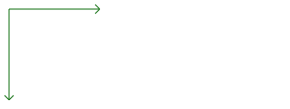
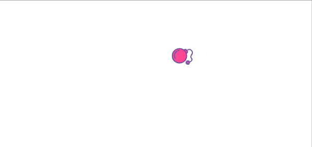
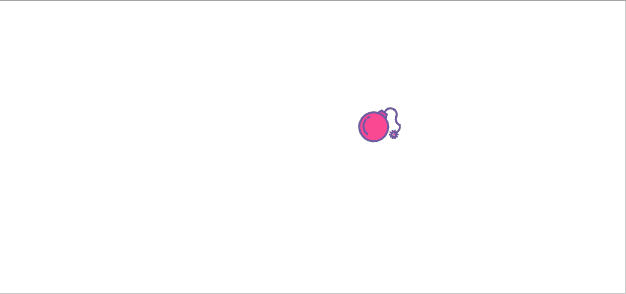
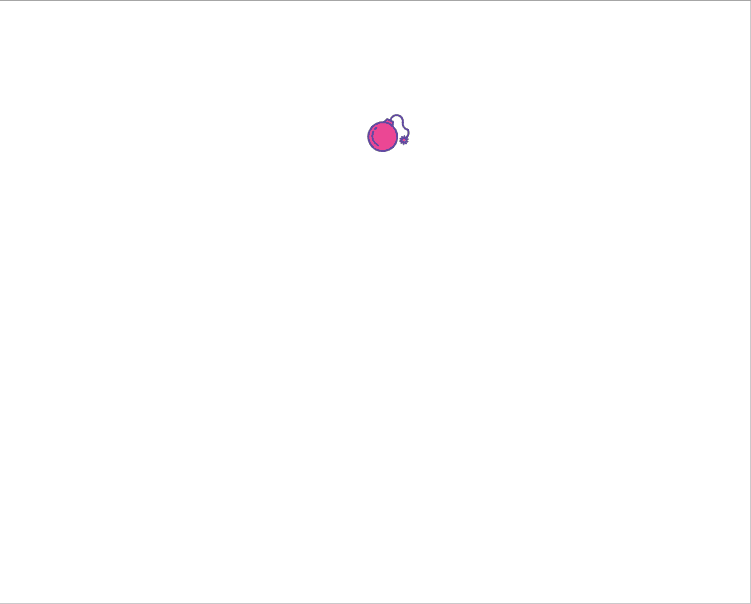
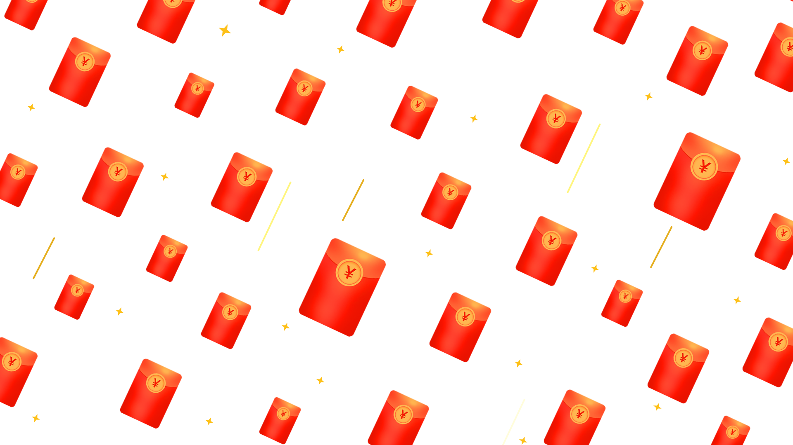
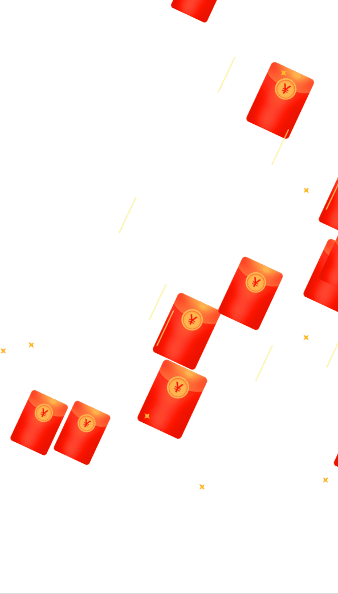

# 前言

对于前端的2D动画需求，一般首先会考虑CSS动画，其次是直接贴图，实在不行可能还要上Canvas。

其实有一大部分需求如果用SVG会更加简单，SVG可以和Js很好的融合在一起，写法上与熟知的CSS动画也大同小异，又可以实现一些纯CSS不好实现的动画，因为其矢量图的性质还可以在微信公众号内直接使用，用来实现一些**交互式动画**让运营小姐姐惊呼卧槽再好不过。

可缩放矢量图形相比位图的优势除了可以无限放大而没有质量损失外的一大优势是一旦掌握其原理，无需打开绘图工具即可手撸图形。

本文会实现几个实用(和不实用)的SVG动画，来熟悉一下SVG的基础和感受一下SVG的魅力((๑＞ڡ＜)☆)。

# SVG基础

SVG的写法上与HTML一致，都是以闭合的标签来定义：

```HTML
<svg class="svg-board" xmlns="http://www.w3.org/2000/svg" style="width: 300px;height: 300px;"></svg>
```

xmlns用来标识应用的命名空间，不写的话某些浏览器可能会解析不正常。

与普通HTML标签一样，可以为它定义class，id等属性，可以通过Js来索引到，也可以为其添加CSS。

## SVG坐标系

与数学中的坐标系不同，计算机中的图形坐标系一般都是以左上角为0,0点，向下移动时增加y，向右移动时增加x，可以设置多种单位，不写的话是px。




## 基本形状和属性

### 基本形状

SVG中基本的形状有以下几种：

```
<rect>、<circle>、<ellipse>、<line>、<polyline>、<polygon>、<path>
```

分别用来定义矩形，圆形，椭圆，线段，多段连续线段，多边形，以及多种图形的组合。

`<rect>`:


`<circle>`:


`<ellipse>`:


`<line>`:


`<polyline>`:


`<polygon>`:


`<path>`:


`<path>`是最强大的图形工具，可以画任意图形，同时也难以掌握，参数众多，手撸比较痛苦，复杂的图形基本靠UI小姐姐切成SVG然后我们在加特效上去。

### 基本属性

他们通用的属性常用的有:

```
fill，stroke，stroke-dasharray，stroke-dashoffset
```

分别代表填充色和轮廓色。

可以直接设置，也可以写成style用CSS来写，以最后的小月亮为例：

```HTML
<svg xmlns="http://www.w3.org/2000/svg"
    xmlns:xlink="http://www.w3.org/1999/xlink">

    <path d="M40,20  A30,30 0 0,0 70,70" style="stroke: #cccc00; stroke-width:2; fill:none;"/>

    <path d="M40,20  A30,30 0 1,0 70,70"
        style="stroke: #ff0000; stroke-width:2; fill:none;"/>
</svg>
```

两段`<path>`都只画了stroke(轮廓)，没有进行填充，两条线弧线拼在一起形成了小月亮，下面给第一个设置为`pink`:

```HTML
<svg xmlns="http://www.w3.org/2000/svg"
    xmlns:xlink="http://www.w3.org/1999/xlink">

    <path d="M40,20  A30,30 0 0,0 70,70" style="stroke: #cccc00; stroke-width:2; fill:pink;"/>

    <path d="M40,20  A30,30 0 1,0 70,70"
        style="stroke: #ff0000; stroke-width:2; fill:none;"/>
</svg>
```


就变成了一个小西瓜。

这里要注意`fill`如果不想要一定要设为`none`，默认的话是黑色的。

`stroke-dasharray`可以设置一组虚线值：

```HTML
<path d="M40,20  A30,30 0 0,0 70,70" style="stroke: #cccc00; stroke-width:2; fill:pink; stroke-dasharray: 10 5 5 10"/>
```

根据你设置的值按照宽度-间隔的模式循环，上面`10 5 5 10`会有一个10px长度的虚线，5px的间隔，之后会有一个5px的虚线，然后10px的间隔，之后按照此模式循环出现虚线。

`stroke-dasharray`一般会与`stroke-dashoffset`一起出现，来做一些线段动画，`stroke-dashoffset`用来设置虚线的起始点。

下面一起来撸一个掘金的logo，并让他一点点绘制起来。

# 线段动画

掘金的logo也是一个svg图形，点开可以看到它是一条`<path>`实现的，实际项目里可能会让UI小姐姐切图出来而不会亲自写`<path>`，下面我们用其他语义化更强的形状来实现一下。

掘金的logo分为三部分，最上面是个菱形，之后是两个折线，写的时候记得翻手册，我也是翻着手册写的(￣▽￣)／。

菱形我们可以用`<polyline>`或者`<polygon>`来填充色实现：

```HTML
<svg xmlns="http://www.w3.org/2000/svg">
    <polygon points="165,0 180,15 165,30 150,15" fill="#1E80FF"></polygon>
</svg>
```


这里如果用填充色后面是没法用stroke-dasharray来让它动起来的，为了方便我们还是用了填充色。

折线我们需要用`polyline`设置一下stroke相关属性来实现：

```HTML
<svg xmlns="http://www.w3.org/2000/svg">
    <polygon points="165,0 180,15 165,30 150,15" fill="#1E80FF"></polygon>
    <polyline points="141,24 165,40 189,24" style="fill:none;stroke-width: 7px;stroke:#1E80FF"></polyline>
    <polyline points="130.5,35.5 165,55 199.5,35.5" style="fill:none;stroke-width: 7px;stroke:#1E80FF"></polyline>
</svg>
```

这里设置fill为none，只设置轮廓颜色来展示两条虚线：


还是稍微有点僵硬，这里不继续打磨了，有兴趣可以自行继续~。

上面说到stroke-dasharray可以这是虚线和虚线的间隔，我们可以将虚线设置的与原stroke长度一样间隔也是刚好可以，然后设置stroke-dashoffset将起始点设置也与长度的一样，这样开始时是一个隐藏的，然后慢慢将offset归零实现一个线段动画。

```HTML
<svg xmlns="http://www.w3.org/2000/svg">
    <polygon points="165,0 180,15 165,30 150,15" fill="#1E80FF"></polygon>
    <polyline class="line" points="141,24 165,40 189,24" style="fill:none;stroke-width: 7px;stroke:#1E80FF"></polyline>
    <polyline class="line2" points="130.5,35.5 165,55 199.5,35.5" style="fill:none;stroke-width: 7px;stroke:#1E80FF"></polyline>

    <style>
        .line {
            stroke-dasharray: 59;
            stroke-dashoffset: 59;

            animation: show 2s linear infinite;
            animation-fill-mode: forwards;
        }

        .line2 {
            stroke-dasharray: 79;
            stroke-dashoffset: 79;

            animation: show2 2s linear infinite;
            animation-fill-mode: forwards;
        }

        @keyframes show {
            0% {
                stroke-dashoffset: 59;
            }

            100% {
                stroke-dashoffset: 0;
            }
        }

        @keyframes show2 {
            0% {
                stroke-dashoffset: 79;
            }

            100% {
                stroke-dashoffset: 0;
            }
        }
    </style>
</svg>
```


一切都是熟悉的CSS动画。

我们甚至可以给原logo做一些改进加上这个动画：


哈哈，有点酷酷的，截得gif帧数较低，没法直接贴带动画的SVG，可以复制自浏览器试试。

```HTML
<svg xmlns="http://www.w3.org/2000/svg">

    <path xmlns="http://www.w3.org/2000/svg" fill-rule="evenodd" clip-rule="evenodd" d="M15.0737 5.80396H15.0757L18.706 2.91722L15.0757 0.00406298L15.0717 0L11.4475 2.91112L15.0717 5.80193L15.0737 5.80396ZM15.0757 14.9111L15.0778 14.9091L24.4429 7.52057L21.9036 5.48096L15.0778 10.8664L15.0757 10.8685L15.0737 10.8705L8.2479 5.48502L5.71057 7.52463L15.0737 14.9132L15.0757 14.9111ZM15.0716 19.9614L15.0757 19.9593L27.614 10.066L30.1534 12.1056L24.449 16.6053L15.0757 24L0.243779 12.3047L0 12.1117L2.53936 10.0721L15.0716 19.9614Z" class="logo"/>

    <style>
        .logo {
            fill: none;
            stroke: #1E80FF;
            stroke-dasharray: 106;
            stroke-dashoffset: 106;
            animation: logo 1.5s linear infinite;
            animation-fill-mode: forwards;
            transform: scale(3);
        }

        @keyframes logo {
            0% {
                stroke-dashoffset: 106;
            }

            100% {
                stroke-dashoffset: 0;
            }

        }
    </style>
</svg>
```


# 微信炸屎

前几天大火的微信炸屎我们来用SVG来实现一下，相比Canvas不用处理每一帧的状态也不用写复杂的数学函数。

## 拆解需求

1. 我们需要三段不同的图片，炸弹，爆炸效果，粑粑。

2. 第一段中我们需要将炸弹丢出去，需要让炸弹沿着抛物线轨迹运动，这个在SVG里可以很轻易的用`<animateMotion>`来实现，用CSS则比较困难。

3. 第二段爆炸我们直接播放gif即可。

4. 第四段粑粑出现与下落是一个Scale增大，transform移动与opacity逐渐透明的过程，其实用CSS也可以轻易实现，不过我们为了SVG的连贯与学习的目的，也用SVG来实现。


## 具体实现

### 炸弹

```HTML
<svg width="500px" height="600px" version="1.1" xmlns="http://www.w3.org/2000/svg">
    <svg height="300px" version="1.1" xmlns="http://www.w3.org/2000/svg">
        <defs>
            <g id="boom">
                <image width="30" height="30"
                href="./zha.svg">
                    <animateMotion path="M 255 79 C 256 79 133 -60 47 33" begin="0s" dur="1s" repeatCount="1" />
                    <animate id="op" attributeName="opacity" from="1" to="0" begin="0.8s" dur="0.2s" repeatCount="1" fill="freeze">
                    </animate>
                    <animateTransform attributeName="transform"
                    type="rotate"
                    from="0 15 15" to="360 15 15"
                    begin="0s" dur="1s"
                    repeatCount="1"
                    />
                </image>
            </g>
        </defs>
        <use href="#boom" />
    </svg>
</svg>
```

`defs/g/svg/symbol`都可以聚合一组SVG内元素，我们每个都试一下，各个都有点细微的区别，defs只用来定义而不显示出里面的SVG，g只聚合不影响内部显示(除非设置了其他属性)，g相比svg来说可以设置`transform`，symbol相比g来说多了`viewbox`和`preserveAspectRation`属性可以设置。

之后可以用`use`来索引到上面元素所定义的svg图形。

`image`和`img`标签类似，来显示图片，内部的我们一共写了三段混合的动画来控制整个过程：

```HTML
<animateMotion path="M 255 79 C 256 79 133 -60 47 33" begin="0s" dur="1s" repeatCount="1" />
```

用来让图片以path定义的路径运动，这个path画出来的话就是一段抛物线，总动运动1秒。

```HTML
<animate id="op" attributeName="opacity" from="1" to="0" begin="0.8s" dur="0.2s" repeatCount="1" fill="freeze">
```

在炸弹快要落地的时候我们要将炸弹隐藏，`fill="freeze"`可以让这段动画的结果变为最终值，类似`animation-fill-mode: forwards`，我们让炸弹最终隐藏掉不再显示。

```HTML
<animateTransform attributeName="transform"
    type="rotate"
    from="0 15 15" to="360 15 15"
    begin="0s" dur="1s"
    repeatCount="1"
/>
```

最后这个混合的动画在抛物线运动一开始执行，让炸弹旋转一圈。

这里要注意一下SVG中旋转与CSS旋转的不同点，CSS中的旋转会以自身中心点开始旋转，SVG则是绕着给定的坐标点旋转，rotate(360, 15, 15)，因为上面我们定义了大小为30x30，自身中心点则是15x15，当然有其他x,y的话还要加上x,y，写的时候注意一下这边。



### 爆炸

爆炸我们直接贴个图即可：

```HTML
<g id="bom">
    <image width="200" height="200"
        opacity="0"
        href="./baozha.gif">
        <animate id="bomStart" begin="op.end" attributeName="opacity" from="1" to="1" dur="0.2s" repeateCount="1"></animate>    
        <animate id="bomEnd" begin="bomStart.end" attributeName="opacity" from="1" to="0" dur="0.2s" repeateCount="1" fill="freeze"></animate>    
    </image>
</g>
```

同样的思路，根据不同的爆炸gif调整调整时间大小即可。



### 粑粑

```HTML
<symbol id="shit">
    <image width="100%" height="50%" opacity="0" href="./shit.png">
        <animate attributeName="opacity" from="1" to="1" begin="bomStart.end" dur="2.4s" repeatCount="1"></animate> 
        <animateTransform id="scale" attributeName="transform" type="scale" from="0.5" to="1" begin="bomStart.end" 
        dur="0.1s"></animateTransform>
        <animateTransform attributeName="transform" type="translate" from="0 0" to="0, 40" begin="scale.end + 0.8s" dur="1.5s" repeatCount="1"></animateTransform>
        <animate attributeName="opacity" from="1" to="0" begin="scale.end + 0.8s" dur="1.5s" repeatCount="1" fill="freeze"></animate> 
    </image>
</symbol>
```

粑粑我们初始显示为透明，我们不需要它一开始就显示，需要在爆炸后出现。

第二段动画变化`scale`，让粑粑从小到大突然出现。

第三段动画则是在粑粑出现后的开始擦屏幕版的向下移动。

最后一段则是一个重新隐藏的过程。

```HTML
<svg style="position:absolute" width="500px" height="400px" version="1.1" xmlns="http://www.w3.org/2000/svg">
    <use x="250" y="30" href="#shit" width="150" height="300" transform="rotate(-17, 250, 30)" />
    <use x="100" y="30" href="#shit" width="120" height="240" />
    <use x="50" y="160" href="#shit" width="90" height="180" />
    <use x="250" y="160" href="#shit" width="180" height="360" />
    <use x="200" y="160" href="#shit" width="90" height="180" />
</svg>
```

一个`use`就是一个粑粑。



可以继续打磨一下，多写几个不同的粑粑效果~。

# 红包雨

每次618，双11活动总能看到淘宝天猫的各类型红包雨，随机出现的红包雨运动曲线让CSS有点难以招架，一般也都会选用Canvas来做，其实也可以用SVG来做。

经过上面的实现我们已经有了SVG动画的知识，我们来简单实现一个下红包雨的效果。



## 拆解需求

1. 红包需要倾斜，需要用到transform rotate，也可以直接贴倾斜的红包图。
2. 红包有大有小，可以用transform scale也可以指定width和height。
3. 红包需要从上至下倾斜运动，需要用到animateMotion。
4. 红包尽可能出现在随机位置，需要连续不断的下雨。

## 具体实现

### 创建单个红包

```HTML
<image
    href="hongbao.png"
    width="100px"
    height="100px"
    style="transform-box: fill-box; transform-origin: center; cursor: pointer"
    transform="rotate(25)"
>
    <!-- 这里也可以分开写animate x y -->
    <animateMotion
        path="M 0 0 L 1000 100"
        begin="0s"
        dur="10s"
        repeatCount="indefinite"
    />
</image>
```

这里我们用width和height来指定红包大小，继续用rotate来旋转红包，我们通过之前的知识知道SVG中的rotate需要指定具体的x,y值，否则不会按中心点旋转，这对于这种需要旋转但是每一帧的位置都不同的元素来说尤其困难，这里我们可以用`transform-box: fill-box; transform-origin: center;`来让SVG中的rotate行为与CSS中默认的行为一致。

倾斜运动这里省事直接写了path，一条斜线。

最后的随机出现我们可以给不同的红包设置不同的dur来造成一种伪随机的现象，当然也可以在它end的时候删掉它加一个新的。这样单个红包的运动就做好啦。

### 形成红包雨

我们只需要将单个红包组合即可生成红包雨，用到Vue或者React等框架的话可以直接写属性，这里直接用原生的撸方便无依赖：

```javascript
<body>
    <svg id="svgboard" version="1.1" xmlns="http://www.w3.org/2000/svg">
    </svg>
</body>
<script>

    const getX = (box=new Array(), config = {}) => {
        // box可传引用，也可以return。
        let maxX = document.documentElement.clientWidth

        config = {
            num: 15,
            minWidth: 104,
            maxWidth: 146,
            minHeight: 145,
            maxHeight: 204,
            durBase: 10,
            imageLink: 'bg.png',
            ...config,
        };
        let { num, minWidth, maxWidth, minHeight, maxHeight, durBase, imageLink } = config;
        for (let i = 0; i < num; i++) {
            let height = Math.random() * (maxHeight - minHeight) + minHeight;

            box.push({
                key: +new Date() + Math.random() + i,
                width: Math.random() * (maxWidth - minWidth) + minWidth,
                height: height,
                x: Math.random() * maxX + 1,
                y: `-${height}`,
                dur: Math.random() * durBase + 1,
                imageLink: imageLink
            });
        }

        return box
    };

    function createSVGElement(elementName) {
        let node = document.createElementNS('http://www.w3.org/2000/svg', elementName)

        return node
    }

    function setAnimation(board, lists) {
        let maxY = document.documentElement.clientHeight
        for (let item of lists) {
            let image = createSVGElement('image')
            image.addEventListener('click', () => {
                // alert会阻塞住整个渲染进程，但动画好像还在继续。
                // 这里最好用Promise直接写一个弹窗。
                alert('哦吼，红包1个亿')
            })
            image.setAttribute('href', item.imageLink)
            image.setAttribute('width', item.width)
            image.setAttribute('height', item.height)
            image.setAttribute('style', 'transform-box: fill-box; transform-origin: center; cursor: pointer')
            image.setAttribute('transform', 'rotate(25)')
            let motion = createSVGElement('animateMotion')
            motion.setAttribute('path', `M ${item.x} ${item.y} L ${item.x - 500} ${maxY + 500}`)
            motion.setAttribute('begin', '0s')
            motion.setAttribute('dur', `${item.dur}s`)
            motion.setAttribute('repeatCount', 'indefinite')

            image.appendChild(motion)

            board.appendChild(image)
        }
    }

    function insertImage() {
        let board = document.querySelector('#svgboard')
        let bgArguments = getX()
        let starArguments = getX(new Array(), {minWidth: 21, maxWidth: 21, minHeight: 21, maxHeight: 21, imageLink: 'star.png'})
        let lineArguments = getX(new Array(), { num: 13, minWidth: 16, maxWidth: 16, minHeight: 114, maxHeight: 114, imageLink: 'line.png'})
        setAnimation(board, bgArguments)
        setAnimation(board, starArguments)
        setAnimation(board, lineArguments)
    }

    insertImage()
</script>
```




里面的图片可以找其他的替换一下，比起Canvas，这个都是熟悉的配方，熟悉的味道~，用框架的话整体可能不超过20行就可以实现~。

# 最后

上面所有完整的代码可以在我的[Github](https://github.com/HuberTRoy/myown/tree/master/%E5%B0%8F%E5%B7%A5%E5%85%B7/%E4%B8%80%E4%BA%9B%E6%9C%89%E8%B6%A3%E7%9A%84%E7%89%B9%E6%95%88)中找到，嘘~，里面还有一个给任意元素添加水波纹效果的SVG。

路过的大哥哥，小姐姐这次一定好不好，想要10个赞抵御台风。😉


