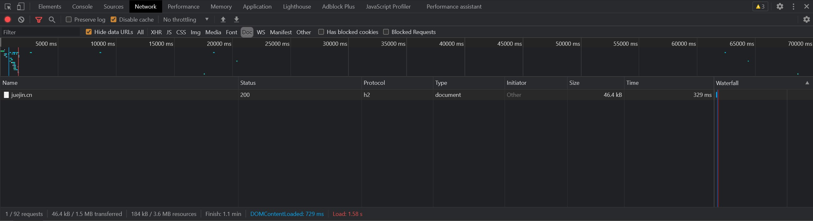
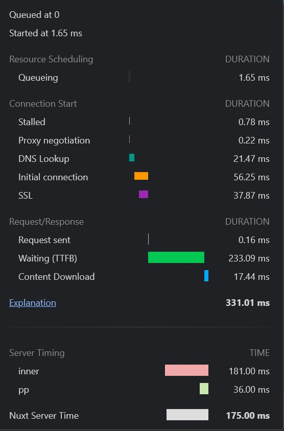
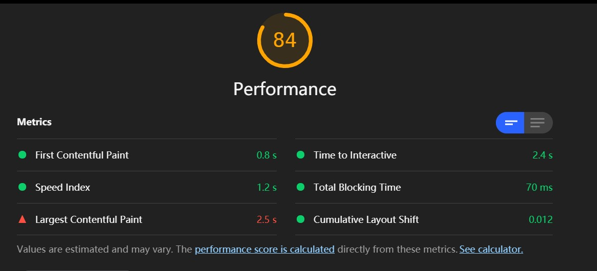
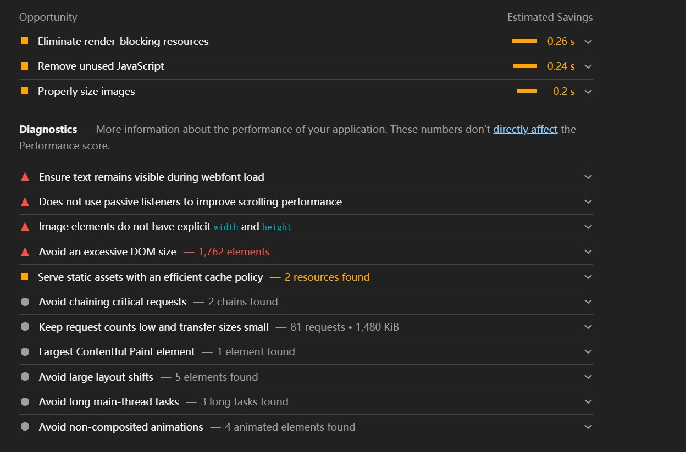
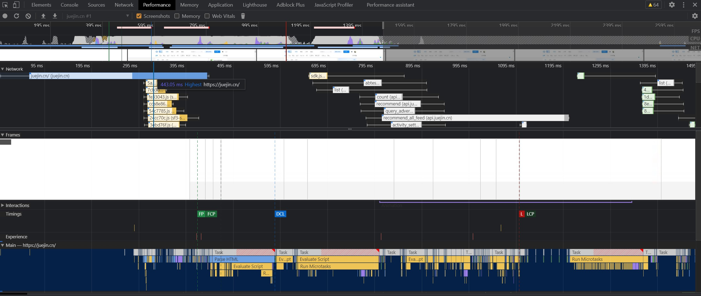
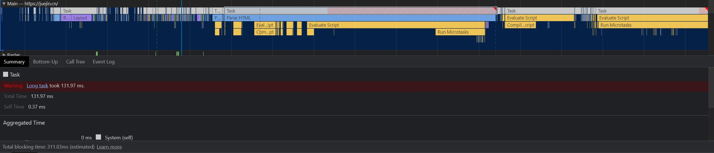
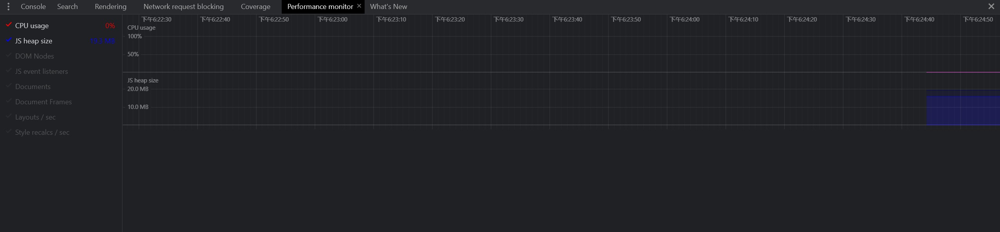

会优化我就不是不优，就是看着慢，哎~，就是玩儿~。


# 前言

**性能优化**是一个项目发展到一定时期之后绕不开的话题，也是每个工程师心中永远在撩拨的刺。

总结一下常用的前端性能优化的方法，希望对大家有些帮助~。

# 性能可能带来的影响(贩卖焦虑警告❗️)


试想当你做的酷炫特效因为慢了`0.1`秒就少被一个人看到时的落寞(ㄒoㄒ)，


试想当你引以为傲的细节交互因为慢了`0.2`秒就被竞争对手的平庸互动拉走用户的气愤(╯>д<)╯⁽˙³˙⁾，


试想当你精心打造的漂亮页面因为慢了`0.3`秒就被搜索引擎无情的排在后面的无奈∑(O_O；)。


所以，是时候重拳出击了，重铸性能的荣光，我辈义不容辞(￣▽￣)／。

# 调试工具

## Network面板

Network面板记录了与服务器交互的具体细节。



在这里我们可以看到发起的请求数量，传输体积以及解压缩后的体积，同时还可以知道哪些资源是命中了强缓存，哪些资源命中的协商缓存。



查看某一个请求的瀑布流可以让我们清晰的看到一个资源从服务器到达我们的电脑所花的时间。

如上图，排队用了1.65ms，DNS查询用了21.47ms，initial connection(进行TCP握手的时间)用了56.25ms，SSL握手的时间用了37.87ms，然后又用了100多ms第一个字节到达我们的电脑(TTFB - 上面的查询/建立)，接收整个文档花了17ms。

这时候我们基于上面的信息就可以粗略的得到，如果能在请求资源之前如果已经得到DNS地址(预查询)可以省去21ms，已经进行过握手可以省去100ms(预连接)，如果干脆请求也不请求可以省去200ms(缓存)继而针对这些点做对应的策略。

Network面板可以让我们初步评估网站性能，对网站整体的体积，网络的影响带来一个整体的认知，同时提供一些辅助功能，如禁用缓存，block某些资源。

## lighthouse面板



lighthouse是对网站整体的评估，通过几个不同的指标给网站进行打分。

**First Contentful Paint** 首屏渲染时间，面试时常问的首屏优化，优化的就是它。

**Time to Interactive** 可交互时间，从能看到能摸的时间点。

**Speed Index** 速度指数，页面的填充速度。

**Total Blocking Time** 从能看到能摸之间超过50ms的任务。

**Largest Contentful Paint** 页面中最大的那块渲染的时间点。

**Cumulative Layout Shift** 元素移动所累积的时间点，比如有一个absolute的元素突然从左边移到了右边。

同时针对网站的信息，lighthouse还会给出一些完善建议：



这些建议可以帮助我们在接下来的优化中提供一个大致的方向。

## performance面板



performance面板会给我们提供一个具体的执行过程，从HTML文档下载，解析HTML，到解析CSS，计算样式，执行JS。

### 火焰图



从火焰图我们可以找到长任务，分析长任务，或者找到某些无关紧要的任务把他们拆分，延后，优化使他们达到一个理想状态。

## performance monitor面板



performance monitor让我们监控内存和CPU的占用，它给出的是整体的占用数据，可以用来观察某一段代码某一个特效会不会造成性能影响。

## webpack-bundle-analyze


如果你用到了webpack打包，可以用它来分析打包后的文件，做成具体策略。

# 从输入一个URL谈起

一个URL为了见到你穿越无数路由器的故事。

## DNS查询

与服务器交互首先要进行DNS查询，浏览器会首先查询自己的缓存，之后会查询本地HOSTS，如果仍然没找到会发起向DNS服务器查询的请求。

在这里我们可以做的优化不多，DNS是我们相对不可控的一个条件，但我们仍然可以做的一个优化策略是预查询。

### 进行DNS预查询

在文档顶部我们可以将我们即将要请求的地址的DNS预先查询，通过插入一个`link`标签

```<link rel="dns-prefetch" href="https://fonts.googleapis.com/">``` 

来告知浏览器我们将要从这个地址(通常会是存放静态资源的CDN的地址，)拉取数据了，你先查询一下，当用到的时候就可以直接拿到对应的IP。

[dns-prefetch](https://developer.mozilla.org/zh-CN/docs/Web/Performance/dns-prefetch)

## 建立HTTP(TCP)连接

得到服务器IP之后，首先进行三次握手，之后会进行SSL握手(HTTPS)，SSL握手时会向服务器端确认HTTP的版本。

针对这方面的优化，前端可做的事情不多，主要是服务器端的事情，不过仍然要了解一下前端可以看得到的策略。

### keep-alive

由于TCP的可靠性，每条独立的TCP连接都会进行一次三次握手，从上面的Network的分析中可以得到握手往往会消耗大部分时间，真正的数据传输反而会少一些(当然取决于内容多少)。HTTP1.0和HTTP1.1为了解决这个问题在header中加入了`Connection: Keep-Alive`，`keep-alive`的连接会保持一段时间不断开，后续的请求都会复用这一条TCP，不过由于管道化的原因也会发生**队头阻塞**的问题。

HTTP1.1默认开启Keep-Alive，HTTP1.0可能现在不多见了，如果你还在用，可以升级一下版本，或者带上这个header。

[connection keeo-alive](https://developer.mozilla.org/zh-CN/docs/Web/HTTP/Headers/Connection)

### HTTP2

HTTP2相对于HTTP1.1的一个主要升级是多路复用，多路复用通过更小的二进制帧构成多条数据流，交错的请求和响应可以**并行传输**而不被阻塞，这样就解决了HTTP1.1时复用会产生的**队头阻塞**的问题，同时HTTP2有首部压缩的功能，如果两个请求首部(headers)相同，那么会省去这一部分，只传输不同的首部字段，进一步减少请求的体积。

Nginx开启HTTP2的方式特别容易，只需要加一句`http2`既可开启：

```
server {
	listen 443 ssl http2; # 加一句 http2.
	server_name domain.com;
}
```

成本低廉，效果巨大。

[HTTP2](https://developer.mozilla.org/zh-CN/docs/Glossary/HTTP_2)

### 缓存

缓存通过复用之前的获取过的资源，可以显著提高网站和应用程序的性能，合理的缓存不仅可以节省巨大的流量也会让用户二次进入时身心愉悦，如果一个资源完全走了本地缓存，那么就可以节省下整个与服务器交互的时间，如果整个网站的内容都被缓存在本地，那即使离线也可以继续访问(很酷，但还没有完全很酷)。

HTTP缓存主要分为两种，一种是强缓存，另一种是协商缓存，都通过Headers控制。

!!!!补图!!!!

#### 强缓存

强缓存根据请求头的`Expires`和`Cache-Control`判断是否命中强缓存，命中强缓存的资源直接从本地加载，不会发起任何网络请求。

`Cache-Control`的值有很多:

```
Cache-Control: max-age=<seconds>
Cache-Control: max-stale[=<seconds>]
Cache-Control: min-fresh=<seconds>
Cache-control: no-cache
Cache-control: no-store
Cache-control: no-transform
Cache-control: only-if-cached
```

常用的有`max-age`，`no-cache`和`no-store`。
`max-age` 是资源从响应开始计时的最大新鲜时间，一般响应中还会出现`age`标明这个资源当前的新鲜程度。
`no-cache` 会让浏览器缓存这个文件到本地但是不用，Network中`disable-cache`勾中的话就会在请求时带上这个haader，会在下一次新鲜度验证通过后使用这个缓存。
`no-store` 会完全放弃缓存这个文件。

服务器响应时的`Cache-Control`略有不同，其中有两个需要注意下: 

1. public, public 表明这个请求可以被任何对象缓存，代理/CDN等中间商。
2. private，private 表明这个请求只能被终端缓存，不允许代理或者CDN等中间商缓存。

`Expires`是一个具体的日期，到了那个日期就会让这个缓存失活，优先级较低，存在`max-age`的情况下会被忽略，和本地时间绑定，修改本地时间可以绕过。

另外，如果你的服务器没有返回`Cache-Control`s，Chrome仍然会按强缓存来缓存这个资源一段时间，如果你不想要缓存的话务必确保有`no-cache`或`no-store`在响应头中。

!!!!补图!!!!

#### 协商缓存


#### CDN

### 压缩

#### GZIP压缩

## 浏览器解析HTML

### 预加载/预连接内容

#### preload

#### prefetch

#### preconnect

### script加标记

#### async标记

#### defer标记

#### 两者的区别

### 页面渲染

#### 视窗外的内容懒加载

#### 避免回流

#### 图片视频选择合理的尺寸

# 打包时可以做的事

## Tree-shaking

## 压缩分块

# 写代码时的注意点

## 动态import()代替静态import做条件渲染的懒加载

## 分级(延迟)加载

### SSR
