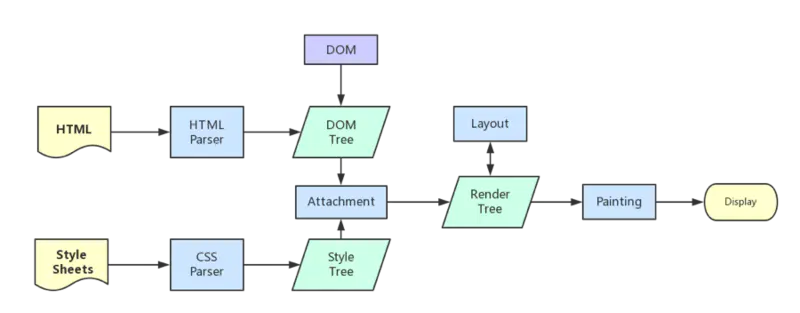
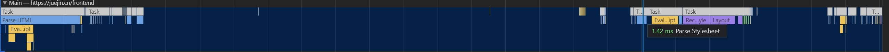
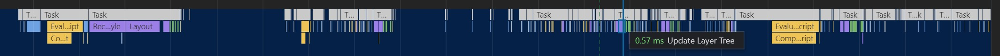
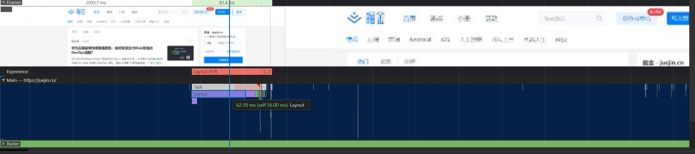

会优化，我就不是不优，就是看着慢，哎~，就是玩儿~。


# 前言

**性能优化**是一个项目发展到一定时期之后绕不开的话题，也是每个工程师心中永远在撩拨的刺。

总结一下常用的前端性能优化的方法，希望对大家有些帮助~。

# 性能可能带来的影响(贩卖焦虑警告❗️)


试想当你做的酷炫特效因为慢了`0.1`秒就少被一个人看到时的落寞(ㄒoㄒ)，


试想当你引以为傲的细节交互因为慢了`0.2`秒就被竞争对手的平庸互动拉走用户的气愤(╯>д<)╯⁽˙³˙⁾，


试想当你精心打造的漂亮页面因为慢了`0.3`秒就被搜索引擎无情的排在后面的无奈∑(O_O；)。


所以，是时候重拳出击了，重铸性能的荣光，我辈义不容辞(￣▽￣)／。

# 调试工具

## Network面板

Network面板记录了与服务器交互的具体细节。


在这里我们可以看到发起的请求数量，传输体积以及解压缩后的体积，同时还可以知道哪些资源是命中了强缓存，哪些资源命中的协商缓存。


查看某一个请求的瀑布流可以让我们清晰的看到一个资源从服务器到达我们的电脑所花的时间。

如上图，排队用了1.65ms，DNS查询用了21.47ms，initial connection(进行TCP握手的时间)用了56.25ms，SSL握手的时间用了37.87ms，然后又用了100多ms第一个字节到达我们的电脑(TTFB - 上面的查询/建立)，接收整个文档花了17ms。

这时候我们基于上面的信息就可以粗略的得到，如果能在请求资源之前如果已经得到DNS地址(预查询)可以省去21ms，已经进行过握手可以省去100ms(预连接)，如果干脆请求也不请求可以省去200ms(缓存)继而针对这些点做对应的策略。

Network面板可以让我们初步评估网站性能，对网站整体的体积，网络的影响带来一个整体的认知，同时提供一些辅助功能，如禁用缓存，block某些资源。

## lighthouse面板


lighthouse是对网站整体的评估，通过几个不同的指标给网站进行打分。

**First Contentful Paint** 首屏渲染时间，面试时常问的首屏优化，优化的就是它。

**Time to Interactive** 可交互时间，从能看到能摸的时间点。

**Speed Index** 速度指数，页面的填充速度。

**Total Blocking Time** 从能看到能摸之间超过50ms的任务。

**Largest Contentful Paint** 页面中最大的那块渲染的时间点。

**Cumulative Layout Shift** 元素移动所累积的时间点，比如有一个absolute的元素突然从左边移到了右边。

同时针对网站的信息，lighthouse还会给出一些完善建议：


这些建议可以帮助我们在接下来的优化中提供一个大致的方向。

## performance面板


performance面板会给我们提供一个具体的执行过程，从HTML文档下载，解析HTML，到解析CSS，计算样式，执行JS。

### 火焰图


从火焰图我们可以找到长任务，分析长任务，或者找到某些无关紧要的任务把他们拆分，延后，优化使他们达到一个理想状态。

## performance monitor面板


performance monitor让我们监控内存和CPU的占用，它给出的是整体的占用数据，可以用来观察某一段代码某一个特效会不会造成性能影响。

## webpack-bundle-analyze


如果你用到了webpack打包，可以用它来分析打包后的文件，做成具体策略。

# 从输入一个URL谈起

这是一个URL为了见到你穿越无数路由器的感人故事。

## DNS查询

与服务器交互首先要进行DNS查询，浏览器会首先查询自己的缓存，之后会查询本地HOSTS，如果仍然没找到会发起向DNS服务器查询的请求。

在这里我们可以做的优化不多，DNS是我们相对不可控的一个条件，但我们仍然可以做的一个优化策略是预查询。

### 进行DNS预查询

在文档顶部我们可以将我们即将要请求的地址的DNS预先查询，通过插入一个`link`标签

```<link rel="dns-prefetch" href="https://fonts.googleapis.com/">``` 

来告知浏览器我们将要从这个地址(通常会是存放静态资源的CDN的地址，)拉取数据了，你先查询一下，当用到的时候就可以直接拿到对应的IP。

[dns-prefetch](https://developer.mozilla.org/zh-CN/docs/Web/Performance/dns-prefetch)

## 建立HTTP(TCP)连接

得到服务器IP之后，首先进行三次握手，之后会进行SSL握手(HTTPS)，SSL握手时会向服务器端确认HTTP的版本。

针对这方面的优化，前端可做的事情不多，主要是服务器端的事情，不过仍然要了解一下前端可以看得到的策略。

### keep-alive

由于TCP的可靠性，每条独立的TCP连接都会进行一次三次握手，从上面的Network的分析中可以得到握手往往会消耗大部分时间，真正的数据传输反而会少一些(当然取决于内容多少)。HTTP1.0和HTTP1.1为了解决这个问题在header中加入了`Connection: Keep-Alive`，`keep-alive`的连接会保持一段时间不断开，后续的请求都会复用这一条TCP，不过由于管道化的原因也会发生**队头阻塞**的问题。

HTTP1.1默认开启Keep-Alive，HTTP1.0可能现在不多见了，如果你还在用，可以升级一下版本，或者带上这个header。

[connection keep-alive](https://developer.mozilla.org/zh-CN/docs/Web/HTTP/Headers/Connection)

### HTTP2

HTTP2相对于HTTP1.1的一个主要升级是多路复用，多路复用通过更小的二进制帧构成多条数据流，交错的请求和响应可以**并行传输**而不被阻塞，这样就解决了HTTP1.1时复用会产生的**队头阻塞**的问题，同时HTTP2有首部压缩的功能，如果两个请求首部(headers)相同，那么会省去这一部分，只传输不同的首部字段，进一步减少请求的体积。

Nginx开启HTTP2的方式特别容易，只需要加一句`http2`既可开启：

```
server {
	listen 443 ssl http2; # 加一句 http2.
	server_name domain.com;
}
```

成本低廉，效果巨大。

[HTTP2](https://developer.mozilla.org/zh-CN/docs/Glossary/HTTP_2)

### 缓存

缓存通过复用之前的获取过的资源，可以显著提高网站和应用程序的性能，合理的缓存不仅可以节省巨大的流量也会让用户二次进入时身心愉悦，如果一个资源完全走了本地缓存，那么就可以节省下整个与服务器交互的时间，如果整个网站的内容都被缓存在本地，那即使离线也可以继续访问(很酷，但还没有完全很酷)。

HTTP缓存主要分为两种，一种是强缓存，另一种是协商缓存，都通过Headers控制。

!!!!补图!!!!

#### 强缓存

强缓存根据请求头的`Expires`和`Cache-Control`判断是否命中强缓存，命中强缓存的资源直接从本地加载，不会发起任何网络请求。

`Cache-Control`的值有很多:

```
Cache-Control: max-age=<seconds>
Cache-Control: max-stale[=<seconds>]
Cache-Control: min-fresh=<seconds>
Cache-control: no-cache
Cache-control: no-store
Cache-control: no-transform
Cache-control: only-if-cached
```

常用的有`max-age`，`no-cache`和`no-store`。
`max-age` 是资源从响应开始计时的最大新鲜时间，一般响应中还会出现`age`标明这个资源当前的新鲜程度。
`no-cache` 会让浏览器缓存这个文件到本地但是不用，Network中`disable-cache`勾中的话就会在请求时带上这个haader，会在下一次新鲜度验证通过后使用这个缓存。
`no-store` 会完全放弃缓存这个文件。

服务器响应时的`Cache-Control`略有不同，其中有两个需要注意下: 

1. public, public 表明这个请求可以被任何对象缓存，代理/CDN等中间商。
2. private，private 表明这个请求只能被终端缓存，不允许代理或者CDN等中间商缓存。

`Expires`是一个具体的日期，到了那个日期就会让这个缓存失活，优先级较低，存在`max-age`的情况下会被忽略，和本地时间绑定，修改本地时间可以绕过。

另外，如果你的服务器的返回内容中不存在`Expires`，`Cache-Control: max-age`，或 `Cache-Control:s-maxage`但是存在`Last-Modified`时，那么浏览器默认会采用一个启发式的算法，即启发式缓存。通常会取响应头的`Date_value - Last-Modified_value`值的10%作为缓存时间，之后Chrome仍然会按强缓存来对待这个资源一段时间，如果你不想要缓存的话务必确保有`no-cache`或`no-store`在响应头中。

!!!!补图!!!!

#### 协商缓存

协商缓存一般会在强缓存新鲜度过期后发起，向服务器确认是否需要更新本地的缓存文件，如果不需要更新，服务器会返回304否则会重新返回整个文件。

服务器响应中会携带`ETag`和`Last-Modified`，`Last-Modified` 表示本地文件最后修改日期，浏览器会在request header加上`If-Modified-Since`（上次返回的`Last-Modified`的值），询问服务器在该日期后资源是否有更新，有更新的话就会将新的资源发送回来。

但是如果在本地打开缓存文件，就会造成`Last-Modified`被修改，所以在HTTP / 1.1 出现了`ETag`。

`Etag`就像一个指纹，资源变化都会导致`ETag`变化，跟最后修改时间没有关系，`ETag`可以保证每一个资源是唯一的

`If-None-Match`的header会将上次返回的`ETag`发送给服务器，询问该资源的`ETag`是否有更新，有变动就会发送新的资源回来

`ETag`(`If-None-Match`)的优先级高于`Last-Modified`(`If-Modified-Since`)，优先使用`ETag`进行确认。

协商缓存比强缓存稍慢，因为还是会发送请求到服务器进行确认。

!!!!补图!!!!

#### CDN

CDN会把源站的资源缓存到CDN服务器，当用户访问的时候就会从最近的CDN服务器拿取资源而不是从源站拿取，这样做的好处是分散了压力，同时也会提升返回访问速度和稳定性。

### 压缩

合理的压缩资源可以有效减少传输体积，减少传输体积的结果就是用户更快的拿到资源开始解析。

压缩在各个阶段都会出现，比如上面提到的HTTP2的首部压缩，进行到这一步的压缩是指对整个资源文件进行的压缩。

浏览器在发起请求时会在headers中携带`accept-encoding: gzip, deflate, br`，告知服务器客户端可以接受的压缩算法，之后响应资源会在响应头中携带`content-encoding: gzip`告知本文件的压缩算法。

#### GZIP压缩

GZIP是非常常用的压缩算法，现代客户端都会支持，你可以在上传文件时就上传一份压缩后的文件，也可以让[Nginx动态压缩](https://juejin.cn/post/6844903605187641357)。

## 关键渲染路径



关键渲染路径是浏览器将HTML/CSS/JS转换为屏幕上看到的像素内容所经过的一系列步骤。

浏览器得到HTML后会开始解析DOM树，CSS资源的下载不会阻塞解析DOM，但是也要注意，如果CSS未下载解析完成是会阻塞最终渲染的。


从Performance面板中可以清晰的看到浏览器如何解析HTML的：



得到HTML后首先会解析HTML，然后解析样式，计算样式，绘制图层等等操作，JS脚本运行，之后可能会重复这一步骤。



在这里前端可以做的事情多了起来，接下来自顶向下说起。

[渲染页面](https://developer.mozilla.org/zh-CN/docs/Web/Performance/How_browsers_work)
### 预加载/预连接内容

和前面说的DNS预查询一样，可以将即将要用到的资源或者即将要握手的地址提前告知浏览器让浏览器利用还在解析HTML计算样式的时间去提前准备好。

#### preload

使用link的`preload`属性预加载一个资源。

```
<link rel="preload" href="style.css" as="style">
```
as属性可以指定预加载的类型，除了style还支持很多类型，常用的一般是`style`和`script`，css和js。

其他的类型可以查看文档:

[preload](https://developer.mozilla.org/zh-CN/docs/Web/HTML/Preloading_content)
#### prefetch

prefetch和preload差不多，prefetch是一个低优先级的获取，通常用在这个资源可能会在用户接下来访问的页面中出现的时候。

当然对当前页面的要用preload，不要用prefetch，可以用到的一个场景是在用户鼠标移入a标签时进行一个prefetch。

[prefetch](https://developer.mozilla.org/zh-CN/docs/Web/HTTP/Link_prefetching_FAQ)

#### preconnect

preconnect和dns-prefetch做的事情类似，提前进行TCP，SSL握手，省去这一部分时间，基于HTTP1.1(keep-alive)和HTTP2(多路复用)的特性，都会在同一个TCP链接内完成接下来的传输任务。

### script加标记

当浏览器解析至script标签时，浏览器的主线程就会等待script，或者运行script，然后继续开始构建，在以前，如果你把script标签放到了文档的最上面，那么在等待下载和运行的这段时间内页面就会处于白屏和无法操作的状态，并且不是并行的下载，浏览器会逐个下载并运行，这是一个相当糟糕的体验。所以都会选择将script放在文档底部，尽可能推后脚本的执行时机，不过并不完全可控。

时至今日，我们可以给script标签增加标记，使其异步(延迟)运行，把可控权交给开发者。

#### async标记

`<script src="main.js" async>`

async标记告诉浏览器在等待js下载期间可以去干其他事，当js下载完成后会立即(尽快)执行，多条js可以并行下载。

async的好处是让多条js不会互相等待，下载期间浏览器会去干其他事(继续解析HTML等)，异步下载，异步执行。

#### defer标记

`<script src="main.js" defer></script>`

与async一样，defer标记告诉浏览器在等待js下载期间可以去干其他事，多条js可以并行下载，不过当js下载完成之后不会立即执行，而是会等待解析完整个HTML之后在开始执行，而且多条defer标记的js会按照顺序执行，

```javascript
<script src="main.js" defer></script>
<script src="main2.js" defer></script>
```

即使`main2.js`先于`main.js`下载完成也会等待`main.js`执行完后再执行。

#### 到底该用哪个标记

两个标记都是为了让script标签实现异步下载，主要的区别在于`async`无法保证顺序且下载完就会执行而`defer`则会等待整个HTML解析之后才会开始执行，并且按照插入的顺序执行。

如果两个script之间没有依赖关系并且可以尽快执行的更加适合使用`async`，反之如果两个script之间有依赖关系，或者希望优先解析HTML，则`defer`更加适合。

### 视窗外的内容懒加载

懒加载也是一个经常被提及的技术，视窗外的内容是不会被用户立即看到的，这时加载过多的内容反而拖慢了网站整体的渲染，我们就可以用懒加载推迟这部分内容的加载来达到加速可访问和可交互性的目的，等用户即将到达视窗内的时候再开始加载这部分内容，通常懒加载会与loading和骨架屏等技术搭配使用。

### 减少无意义的回流

回流与重绘是一个老生常谈的问题，当浏览器大小改变/滚动，DOM增删，元素尺寸或者位置发生改变时都会发生回流，回流意味着浏览器要重新计算当前页面的与之相关的所有元素，重新进行整体的布局。



这是一个非常消耗性能的事情，有些情况下回流无法避免，有些情况下则可以省略无意义的回流，比如用Js将20个`li`更改到同样的尺寸时避免将每个`li`都即时更改，应该用`class`一次性更改。

### 图片视频选择合理的尺寸

分辨率越高的图片显示出来越消耗性能，当然带来的好处是更加的清晰，但很多情况下清晰并不是一个特别重要的标准，我们可以牺牲一部分清晰度来让图片视频体积更小，通常PC使用1倍图，移动端使用2倍图就够了，原图可以结合懒加载等待空闲或者主动触发时在加载，像是微信QQ等聊天时发的表情包一样，都是点开才会加载原图。

这往往是一个容易被忽略(可能因为感觉没必要)提升又很大的事情，如果你的网站图片很多强烈建议着手优化。

选择一个支持动态剪裁的云服务即可享受这份美好~。

# 写代码时可以做的事

上面从代码写完的角度谈起，接下来从写代码的角度谈起。

首先是打包。

## Tree-shaking

`Tree-shaking`指的是消除没被引用的模块代码，减少代码体积大小，以提高页面的性能，最初由rollup提出。 

webpack2加入对`Tree-shaking`的支持，webpack4中`Tree-shaking`默认开启，`Tree-shaking`基于`ESModule`静态编译而成，所以如果想要生效，在写代码的时候注意不要用CommonJS的模块，同时也要注意不要让babel给编译成CommonJS的形式。

`Tree-shaking`连带的有一个`sideEffects`的概念，因为Js的特性使得完全静态分析是一个很难的事情，很多代码往往会带有副作用，比如一下代码:

```javascript
class Handler {
    handleEvent() {
        console.log('You called me.')
    }
}

window.addEventListener('visibilitychange', new Handler())
```

在上面的代码中不存在任何显式的调用`handleEvent`，但当`visibilitychange`发生时Js会去调用`handleEvent`，这个类就属于有副作用的一种，它是不能被抖掉的代码（实际上webpack也不会对类有啥想法）。

如果你确定某个文件是这种含有副作用的文件，可以在`package.json`中添加`sideEffects: ['class.js']`让webpack强行打包进去。

对于一些第三方库来说为了兼容性考虑通常入口文件都是CommonJS的形式，这时想要成功抖掉不需要的部分通常有两种方式。

以出镜率极高的`lodash`为例。

`lodash`默认是CommonJS的形式，使用常规的方法`import { cloneDeep } from 'lodash'`导入后，webpack会把整个`lodash`打包进来，这对于只用到了一个函数的我们的来说显然不可接受，此时可以改写为：

```javascript
import cloneDeep from 'lodash/cloneDeep'
```

或者如果提供了ESModule的版本也可以直接使用:

```javascript
import { cloneDeep } from 'lodash-es
```

前者是精准导入不依赖`re-exports`，后者则是一个正经的`Tree-shaking`。

## 压缩

生产环境的代码不是给人看的，所以不需要考虑可读性（降低可读性还能提高被破解的成本o(≧口≦)o），尽可能少的字符是最优选项，webpack4+无需配置默认会压缩代码，如果你想亲自试试，Js可选[UglifyJS](https://github.com/mishoo/UglifyJS)，CSS可选[mini-css-extract-plugin](https://github.com/webpack-contrib/mini-css-extract-plugin)。

```javascript
const MiniCssExtractPlugin = require('mini-css-extract-plugin');
const CssMinimizerPlugin = require('css-minimizer-webpack-plugin');

module.exports = {
  plugins: [
    new MiniCssExtractPlugin({
      filename: '[name].css',
      chunkFilename: '[id].css',
    }),
  ],
  module: {
    rules: [
      {
        test: /\.css$/,
        use: [MiniCssExtractPlugin.loader, 'css-loader'],
      },
    ],
  },
  optimization: {
    minimizer: [
      new CssMinimizerPlugin(),
    ],
  },
};
```

## 动态import()代替静态import做条件渲染的懒加载

又是你~，懒加载。

如果你是Vue选手，最先接触到的`import()`可能是`vue-router`文档中关于[路由懒加载](https://router.vuejs.org/zh/guide/advanced/lazy-loading.html)，其实具体到组件内部，也可以用同样的方式将一些基于判断条件的子组件/第三方库通过`import()`的方式导入，这样webpack在打包时会单独将它列为一个块，当符合判断条件时才会尝试去加载这个文件。

```javascript
<template>
    <div>
        <sub-component v-if="status" />
    </div>
</tamplate>
<script>
export default {
    components: {
        "sub-component": import('./sub-component')
    },
    data() {
        return {
            status: false
        }
    },
    mounted() {
        setTimeout(() => {
            this.status = true
        }, 10000)
    }
}
</script>
```

### SSR

利用服务器端优先渲染出某一部分重要的内容，让其他内容懒加载，这样到达浏览器端时一部分HTML已经存在，页面上就可以呈现出一定的内容，这里注意服务器端渲染出来的HTML部分最好不要超过14kb，TCP慢开始的规则让第一个TCP包的大小是14kb，这是与网站交互会接受到的第一个包。


# 更多优化手段

目前所知的优化手段~，更多的优化待发掘中，路过的大哥们、小姐姐们还请给个赞👍，有问题的也可留言交流~😝。

