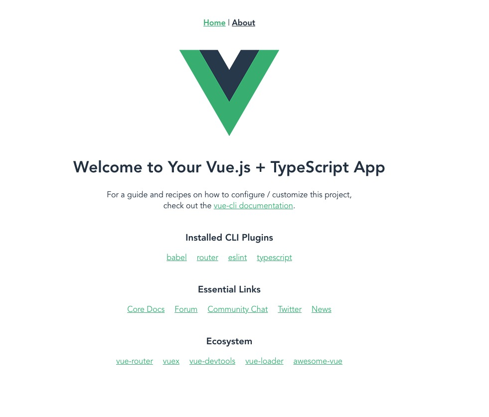
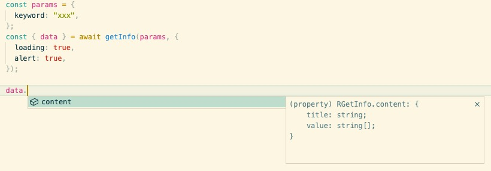

# 前言

最近要和朋友一起写一个新的项目，由于项目没有历史包袱，在经过讨论后选择了 Vue3 作为前端框架，Vite 的开发时体验实在是很棒，但公司也不想放弃 Webpack 在生产环境的稳定。

朋友经过不懈的探(cai)索(keng)搭了一套用起来很舒服的基础配置~，话不多说直接开搞 💪。

# 基础项目搭建 Vite + Webpack + Ts

这里我们选择用`Vue-cli`来创建基础 Vue3 项目然后添加 Vite 的支持，不选择`Vite`来创建基础项目的原因是加 Vite 比加 Webpack 要容易一些，前人已经留下了许多经验。

另外如果你不需要 Webpack 的支持，可以跳过下面的`添加Vite`，`vite-plugin-html-template`和`vite-plugin-environment`部分。

## Vue-cli 创建 Vue3 项目

这里是你已经轻车熟路但还是要贴的命令：

`yarn global add @vue/cli`

`vue create project`

在这里可选 Ts 和 Eslint，已经 2202 年了，这些该上就上吧~。

## ⚡️ 增加 Vite 支持，使用 Vite 开发

Vite 的爽点这里就不说了，嘿嘿嘿嘿 ⚡️⚡️⚡️。

要添加 Vite 的支持我们首先需要安装`Vite`与`@vitejs/plugin-vue`：

```
yarn add vite

yarn add @vitejs/plugin-vue
```

我们在根目录下创建 `vite.config.js`，写入基础的配置：

```ts
import { defineConfig } from "vite";
import vue from "@vitejs/plugin-vue";

export default defineConfig({
  resolve: {
    alias: {
      "@": "/src",
      store: "/src/store",
    },
  },
  plugins: [vue()],
});
```

这里我们添加了基础的 alias 以及 Vite 需要的配置，当然现在配置还不够，无法顺利跑起来。

配置 alias 的话对应的 `tsconfig.json` 中也需要添加 path:

```json
{
  "paths": {
    "@/*": ["src/*"],
    "store/*": ["src/store/*"]
  }
}
```

更多关于`@vitejs/plugin-vue`的配置信息：https://www.npmjs.com/package/@vitejs/plugin-vue

## 🛠️ vite-plugin-html-template

由于我们需要同时支持 Webpack 和 Vite，在处理我们最终输出的 html 的时候(SPA 应用总会有一个出口 html)我们需要让 Vite 与 Webpack 保持一致，做代码上的兼容，这个插件帮我们完成了这件事情。

`yarn add vite-plugin-html-template`

```ts
import { defineConfig } from "vite";
import vue from "@vitejs/plugin-vue";
import htmlTemplate from "vite-plugin-html-template";

export default defineConfig({
  resolve: {
    alias: {
      "@": "/src",
      store: "/src/store",
    },
  },
  plugins: [vue(), htmlTemplate()],
});
```

单页面应用的话不需要额外配置，如果你想搞一个多页面应用，可以看一下它的配置信息：

https://www.npmjs.com/package/vite-plugin-html-template

## 🔩 vite-plugin-environment

在某一次 Vite 的迭代中环境变量`process`变成了`import.meta`但 Webpack 上还是用的`process`，与 html 一样我们需要做一个兼容，让 Webpack 和 Vite 都可以运行，这个插件可以帮我们做这件事情：

`yarn add vite-plugin-environment`

```ts
import { defineConfig } from "vite";
import vue from "@vitejs/plugin-vue";
import htmlTemplate from "vite-plugin-html-template";
import EnvironmentPlugin from "vite-plugin-environment";

export default defineConfig({
  resolve: {
    alias: {
      "@": "/src",
      store: "/src/store",
    },
  },
  plugins: [
    vue(),
    htmlTemplate(),
    EnvironmentPlugin("all", { prefix: "VUE_APP_" }),
  ],
});
```

创建环境变量的写法与之前一致，all 与 prefix 搭配使用，可以加载全部是这个前缀的环境变量。

```
WARNING

如果没有写任何环境变量文件的话插件还是不会生成process变量，至少需要存在一个.env文件和一个环境变量。
```

如果不想增加额外的插件也有直接写的方式：

```ts
import { defineConfig } from "vite";
// ...
export default defineConfig({
  // ...
  define: {
    "process.env": {
      VUE_APP_API_URL: "https://www.baidu.com",
    },
  },
});
```

更多关于环境变量的讨论可以看这个 Issue:

https://github.com/vitejs/vite/issues/1973

添加完这个插件我们就可以跑起 Hello World 啦：

可以直接`yarn vite`，当然比较正经的做法是在`package.json`里添加：

```json
{
  "scripts": {
    "dev": "vite --mode dev"
  }
}
```



# 🔑 自动导入 autoimport

Vue3 的 setup 语法很香，让我们写 CompositionAPI 的时候少了很多重复的内容，但写 Vue3 的时候 ref，computed 这些还是需要我们导入，虽然并不麻烦但没有必要，2202 年的 Vue3 不需要这些繁琐的内容：

1. `yarn add unplugin-auto-import`。
2. 在 `vite.config.js` 中 `plugins` 里添加：

```ts
import { defineConfig } from "vite";
import AutoImport from "unplugin-auto-import/vite";

...

export default defineConfig({
  ...,
  plugins: [
    ...,
    AutoImport({
      imports: ["vue", "vue-router"],
      eslintrc: {
        enabled: true,
      },
      dts: "./src/types/auto-imports.d.ts",
    }),
  ],
});
```

如果没有配置 typescript 的话可以不生成 d.ts，如果没有配置 eslint 的话也可以把 eslint 的关闭。

这里如果开启了 eslint 并且配置的是用双引号代替单引号的话可以创建一个`.eslintignore`把`auto-imports.d.ts`加进去，还需要把生成的`.eslintrc-auto-import.json`加到`.eslintrc.js`里去：

```js
{
  extends: [
      ...,
      "./.eslintrc-auto-import.json",
  ],
}
```

。

3. 同时在 Webpack 的配置中我们也需要把 autoimport 添加进去，否则打包会报错：

`vue.config.js`:

```js
const { defineConfig } = require("@vue/cli-service");
module.exports = defineConfig({
  transpileDependencies: true,
  configureWebpack: {
    resolve: {
      alias: {
        "@": "/src",
        store: "/src/store",
      },
    },
    plugins: [
      require("unplugin-auto-import/webpack")({
        imports: ["vue", "vue-router"],
        dts: false,
      }),
    ],
  },
});
```

我们的 Webpack 只在打包时使用，不需要 ts 和 eslint。

```
Tips

WebStorm不显式导入的话会没有类型提示，想要的话还是需要 import 喔。

```

# ⚙ git hooks

保证代码格式的健壮性和一致性是很重要的，我们这里在提交代码时增加一道 git hooks 检查：

`yarn add lint-staged`

package.json:

```json
{
  "gitHooks": {
    "pre-commit": "lint-staged"
  },
  "lint-staged": {
    "*.{js,jsx,vue,ts,tsx}": ["vue-cli-service lint"]
  }
}
```

除了仅检查，我们还可以增加自动`prettier`的格式化，强制保持风格统一：

```json
{
  "lint-staged": {
    "*.{js,jsx,vue,ts,tsx}": [
      "prettier --write --config .prettierrc", // 用默认配置的话可以不指定--config。
      "vue-cli-service lint",
      "git add" // prettier 的话有可能会修改原文件不要忘记在git add 一下。
    ]
  }
}
```

# 📦 其他有用的基础配置

## babel 的一些有用的配置

`可选链操作符(?.)`和`空值合并运算符(??)`在写业务时非常香，由于开发时我们用的 `Vite` + `Ts`，而默认的 `Ts` 编译为 `esnext` 天生就支持了这两个运算符，不会编译到更低版本（当然如果你遇到的棘手的兼容性 BUG 就需要编译至更低版本了，祝你好运）。

这里我们可以给 `babel` 添加这些配置来让 `Webpack` 的打包生效：

`yarn add @babel/plugin-proposal-optional-chaining`

`yarn add @babel/plugin-proposal-nullish-coalescing-operator`

在`babel.config.js`中：

```json
{
  "plugins": [
    "@babel/plugin-proposal-optional-chaining",
    "@babel/plugin-proposal-nullish-coalescing-operator"
  ]
}
```

## 可能想忽略的 ts 错误

在 git hooks 一节里我们并没有配置提交时的 `Ts` 的检查，`Ts` 的检查没法像 `eslint` 检查一样只对做出修改的文件生效，如果每次提交前都做 `Ts` 的全量检查会花很多时间，所以我们把 `Ts` 的检查放在了打包处(这里 Vue-cli 开箱即用，不需要配置)。

`Ts` 全量检查可以为我们发现很多业务中 breaking change 的类型错误(API 类型更改，组件 props 更改等等)，但有时也会有一些没有来得及更新的第三方库的 type 本身无法通过检查(说的就是你七牛桑)，这里我们可以通过配置`fork-ts-checker`来跳过一些目录/文件的 `Ts` 检查，这是一个仅 Webpack 的配置：

vue.config.js:

```js

  chainWebpack: config => {
    config.plugins.get("fork-ts-checker").tap(options => {
      options[0].issue = {};
      options[0].issue.exclude = [{ file: "node_modules/*" }];
      return options;
    });
  },
```

# ❤️ axios 封装

axios 的封装相信大家都有自己的见解，这里朋友封装的这个 axios 个人感觉非常好用，在这里抛个砖希望引到你的玉~。

定义基础的拦截器逻辑：

```ts
import axios, { AxiosRequestConfig, AxiosResponse, Method } from "axios";

type Config = AxiosRequestConfig & {
  alert?: boolean;
  loading?: boolean;
  loadingText?: string;
};

type Plugin = {
  request?: (config: Config) => Config;
  response?: (data: AxiosResponse) => AxiosResponse;
};

const instance = axios.create({
  baseURL: process.env.VUE_APP_API_BASE_URL,
});

const usePlugin = (plugin: Plugin) => {
  if (plugin.request) {
    instance.interceptors.request.use(plugin.request);
  }

  if (plugin.response) {
    instance.interceptors.response.use(plugin.response);
  }
};

const loadingPlugin: Plugin = {
  request: config => {
    if (config.loading) {
      Toast.loading(config.loadingText || "加载中...");
    }

    return config;
  },
  response: data => {
    const config = data.config as Config;
    if (config.loading) {
      Toast.clear();
    }

    return data;
  },
};

const alertPlugin: Plugin = {
  response: data => {
    const config = data.config as Config;
    if (config.alert === true) {
      Toast.fail({
        message: "这里写从接口取到的错误提示",
      });
    }
    return data;
  },
};

usePlugin(loadingPlugin);
usePlugin(alertPlugin);

// 可以扩展不同的拦截器逻辑
```

这里用 axios 链式调用的思路，每一种拦截器的逻辑互相独立，互不耦合，很容易修改和扩展，每个拦截器只做一件事。

这里额外添加了两个比较常用的功能，一个是自动 loading 默认关闭，一个是有错误时(当然 demo 里没写错误的处理，用的话需要写一下这里的逻辑)的 toast，两者都可以通过配置开关，写业务时可以省很多事~。

接下来是对请求和返回增加`Typescript`的支持：

```ts
export type CommonRes<T = any> = {
  code: number;
  msg: string;
  data: T;
};

type Request<R, T> = (params?: T, config?: Config) => Promise<CommonRes<R>>;
type RequestMethod = <R, T = any>(
  url: string,
  config?: Config
) => Request<R, T>;

const wrapperRequest = (method: Method): RequestMethod => {
  // 默认如果有错误会自动弹出toast，后面也可以关闭。
  return <R, T = any>(url: string, config: Config = { alert: true }) => {
    return (params?: T, requestConfig?: Config) => {
      let realParams = [
        url,
        params,
        {
          ...config,
          ...requestConfig,
        },
      ];
      if (method.toLowerCase() === "get") {
        realParams = [url, { params: params, ...config, ...requestConfig }];
      }

      // 这里axios的定义是<T = any, R = AxiosResponse<T>, D = any>
      // 如果在responseInterceptor里完全修改了返回值，第一个参数是必传的。
      return instance[method]<any, CommonRes<R>>(...realParams);
    };
  };
};

const post = wrapperRequest("post");
const del = wrapperRequest("delete");
const put = wrapperRequest("put");
const get = wrapperRequest("get");
```

这里我们封装了一层统一的返回值 Type:

```ts
export type CommonRes<T = any> = {
  code: number;
  msg: string;
  data: T;
};
```

和你的后端保持一致即可，这里用到了泛型，以便让我们实际定义接口时将实际的返回值的类型传入。

实际定义接口：

```ts
export interface RGetInfo {
  content: {
    title: string;
    value: string[];
  };
}

export interface PGetInfo {
  keyword: string;
}

export const getInfo = get<RGetInfo, PGetInfo>("/api/getInfo");
```

这里我们将传参的类型泛型放在了第二个，返回值的类型放在了第一个，可以根据业务和技术要求频率调换位置。

实际业务中的用法：

```ts
async () => {
  const params = {
    keyword: "xxx",
  };
  const { data } = await getInfo(params, {
    loading: true,
    alert: true,
  });
};
```



可以看到 data 的类型已经按我们定义好的类型提示了出来，loading 与 alert 可以直接传参控制，减少大量重复代码，享受美好~。

# pinia

pinia 作为 vuex 的升级版非常简单易用，直接撸官方文档没有坑点，大菠萝，燥起来。

https://pinia.vuejs.org/introduction.html#basic-example

# 💡 一些 Vue3 的小 Tips

## props type 和 default props

如果用的`<script lang="ts" setup>`语法，在定义带有 type 的 props 时有点反直觉：

```ts
defineProps<{
  msg: string;
}>();
```

这里仅需要传入 typescript 的定义即可，不需要给`defineProps`在传入参数，想要给 props 写默认语法也需要引入另一个函数：

```ts
interface Props {
  msg?: string;
  labels?: string[];
}

const props = withDefaults(defineProps<Props>(), {
  msg: "hello",
  labels: () => ["one", "two"],
});
```

而且要注意的是 `defineProps` 是一个**编译期**进行编译的东西，仅写在`setup`里有效的内容，所以想把 `withDefaults` 和 `defineProps` 进行一次封装让它更好用一点暂时是没有办法了。

https://vuejs.org/api/sfc-script-setup.html#defineprops-defineemits

## watch 时可能出现的困扰

### 没法直接 watch props

如果用过 Vue2，那我们可能先入为主的以为可以直接 watch props 的值：

```js
{
  props: {
    msg: {
      type: String
    }
  },
  watch: {
    msg(val) {
      console.log(val)
    }
  }
}
```

在 CompositionAPI 里我们没法直接 watch 它了：

```ts
const props = defineProps<{
  msg: string;
}>();

// 不能直接 watch 值
watch(props.msg, () => {
  console.log(props.msg);
});
```

`props.msg`本身不是一个 ref，只是一个值，watch 是无法监听具体值的变化的，这里可以用两种方式来监听。

1. 转成 ref：

```ts
const propsRefs = toRefs(props);
```

通过`toRefs`转化后将 reactive 的 props 展平，这样 propsRefs.msg 就是一个 ref，此时就可以监听到，但弊端也很明显，因为转成了 ref，取值时就需要加上`.value`: `propsRefs.msg.value`。

2. 通过 getter 函数来监听：

watch 本身可以监听一个 getter 函数，所以我们可以直接用取值函数：

```ts
watch(
  () => props.msg,
  () => {
    console.log(props.msg);
  }
);
```

这里个人推荐第二种方式~。

### watch 数组

如果你在 Vue2 里习惯监听一个数组并喜欢用内置方法直接修改原数组：

```ts
let array = [];
array.push("Vue2");
```

那在 Vue3 里这样的 watch 将不在可以直接生效，需要传入 deep:

```ts
let array = ref([]);

watch(
  array,
  () => {
    console.log(array);
  },
  {
    deep: true,
  }
);

array.push("Vue2");
```

具体可以看：

https://github.com/vuejs/core/issues/2116

不过问题现在还处于 Open，以后会改也说不定。

## 有限的访问组件内部接口

在 Vue2 中没法约束外部组件可使用的内部组件方法，这意味着外部组件可以直接调用/修改内部组件的函数/变量来干预内部组件的运行逻辑。

这样做会导致的问题是组件的维护者并不知道调用者会干预内部允许，当组件更新时容易造成双方的扯皮，为了收窄方法，Vue3 终于有了方式。
`setup`语法糖下默认不会提供任何内部组件的变量，取而代之的是 `defineExpose`来仅暴露你想暴露的接口给外部。

```vue
<script setup>
import { ref } from "vue";
const a = 1;
const b = ref(2);
defineExpose({ a, b });
</script>
```

https://vuejs.org/api/sfc-script-setup.html#defineexpose
