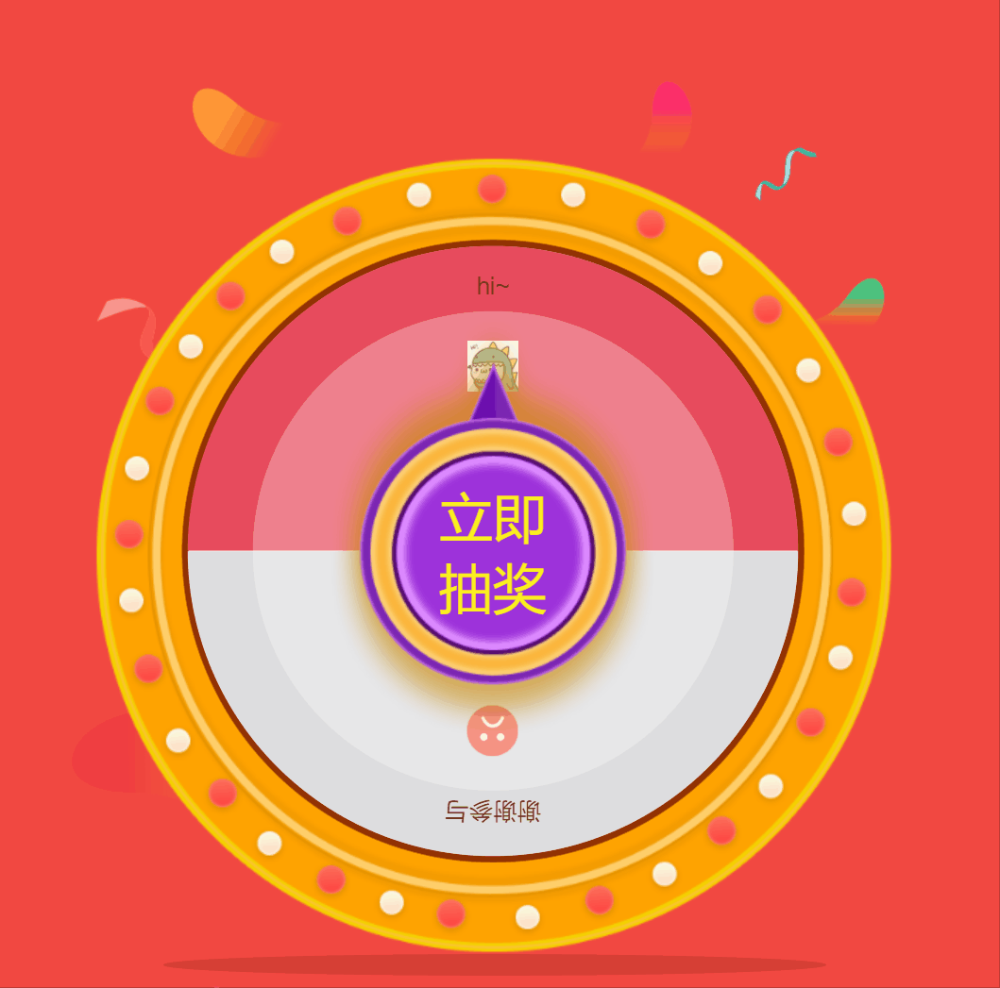
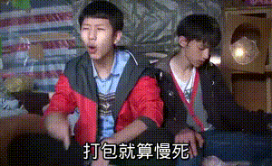
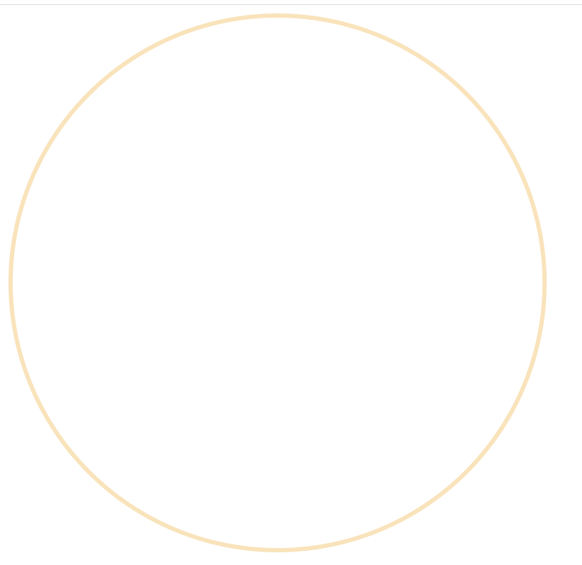
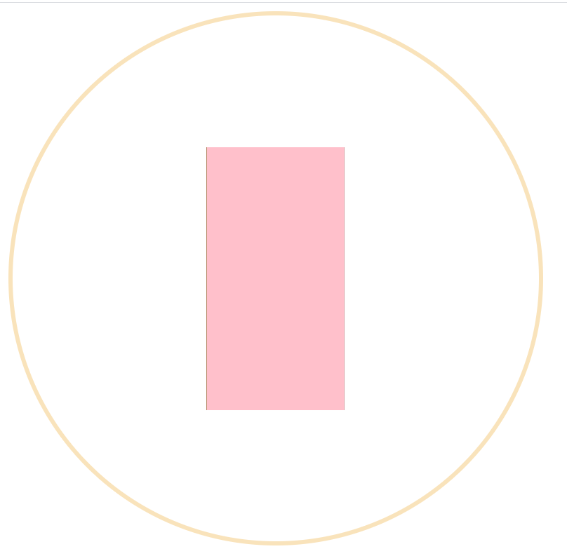
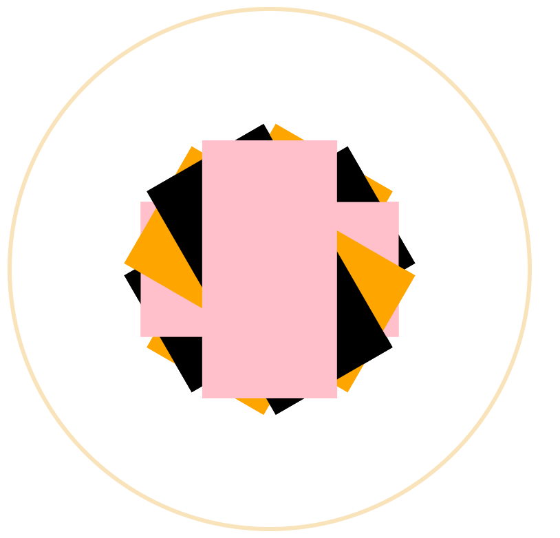
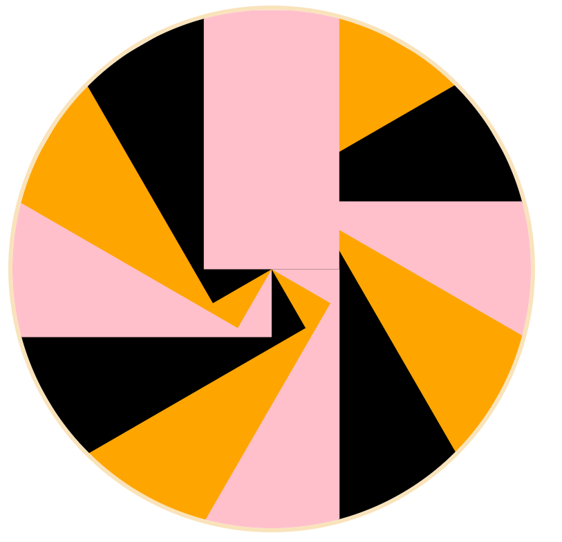
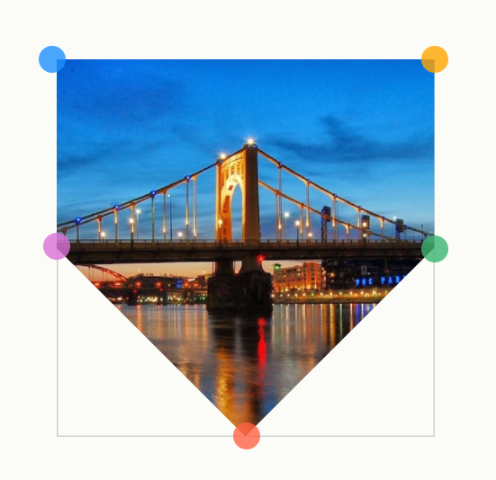
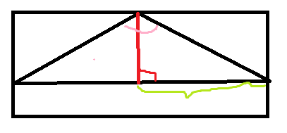
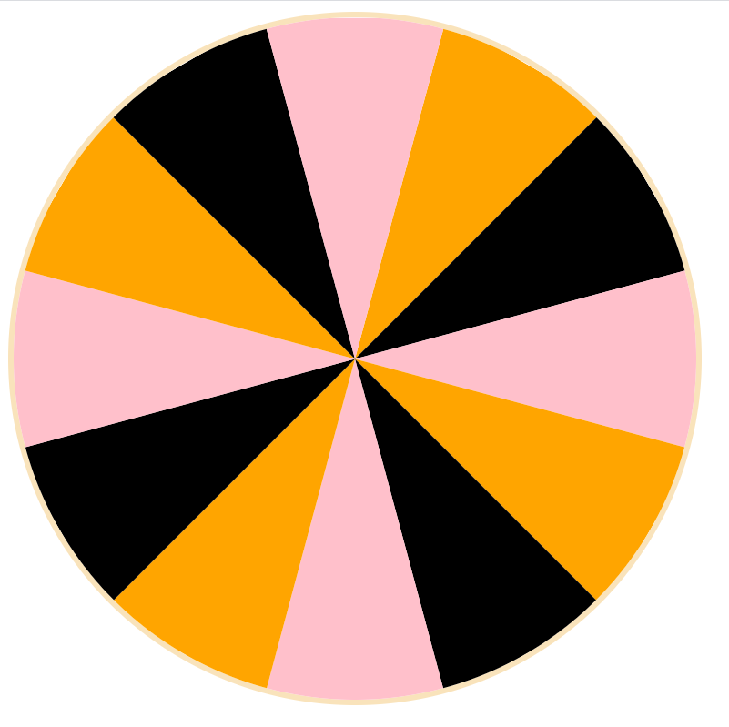
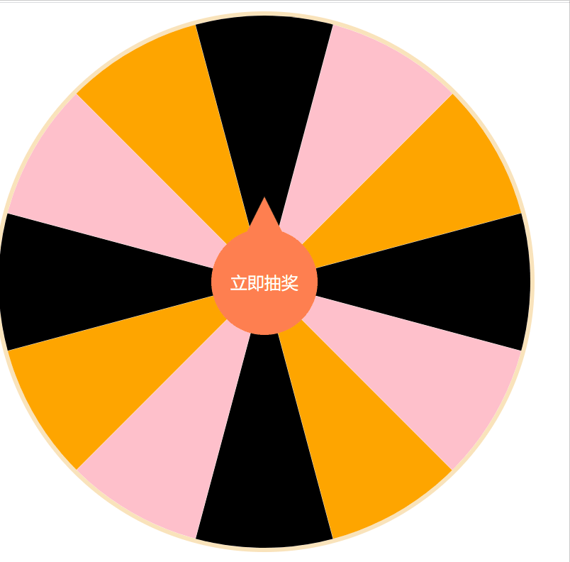

# 叮，你的礼物已到账

最近要实现一个大转盘效果，找了一下大部分是基于Canvas做的，不容易配置，可扩展性也比较弱，作为一个大(cai)佬(niao)当然不能接受这样的情况，于是在一个月黑风高的夜里，和漂亮姐姐深入交流后搞出了这个基于CSS的大转盘。


# 先上效果



上图是用的Vue2，支持任意数量的奖品，这个效果用什么框架都可以轻松实现，正好Vue3出了，本文一起用Vue3的Composition API实现一下~。

# 准备工作

[Vite](https://vitejs.dev/guide/#scaffolding-your-first-vite-project)，真香~。



yarn安装：

```
yarn create @vitejs/app
```

直接模板一键生成：

```
yarn create @vitejs/app my-vue-app --template vue
```

ts上不上都可。


# 理论基础

一个基础的大转盘分为三部分：

1. 圆的背景。
2. 扇形组成的一圈奖品。
3. 位于中心的抽奖按钮。

画好转盘之后我们需要用`animation`动画让转盘动起来和停下。


# 背景

```HTML
<div class="luckydraw-wheel" :style="{
    width: `${width}px`,
    height: `${height}px`
}">

    <div class="luckydraw-wheel-wrapper" ref="luckyWrapper">
    </div>
</div>
```

width和height我们将其暴露为props，这样可以让组件由外部自定义宽高。

```javascript
import { defineComponent } from 'vue'

export default defineComponent({
    props: {
        width: {
            type: Number,
            default: 500
        },
        height: {
            type: Number,
            default: 500
        },
    }
})
```

```css
.luckydraw-wheel {
    background: #fff;
    border-radius: 50%;
    border: 4px solid rgba(249, 227, 187, 1);
    position: relative;
}

.luckydraw-wheel-wrapper {
    position: relative;
    height: 100%;
    width: 100%;
    border-radius: 50%;
    overflow: hidden;
}
```

核心是`border-radius`定义一个圆，内层的div用来转动转盘，当然也可以直接转外层的这个，这边看你自己怎么实现。

`overflow: hidden`也是必要的，为了实现圆弧。




# 奖品

```HTML
<div class="luckydraw-wheel-item" 
     v-for="index in 12" 
     :key="index"
     :style="calcStyle(index)"
>
</div>
```

我们定义12个奖品，目标是将这12个奖品围绕圆的中心点环绕，这种布局我们没有现成的布局属性可以使用，需要自己计算每块奖品的位置。

我们知道在`absolute`定位下设置`top: 50%; left: 50%; transform: translate(-50%, -50%);`即可让元素垂直水平居中。

设置的`top`和`left`会对应元素的上和左边，所以居中需要向相反位置移动自身的一半。

```CSS
.luckydraw-wheel-item {
    position: absolute;
    top: 25%;
    left: 50%;
}
```

这是基础的样式，我们先不设置`transform`和其他属性，这些需要我们计算出来。

先明确一下圆的直径是传入的`width`和`height`(值一样)。

奖品`item`的属性中：

1. 高度应为圆的半径(`height/2`)，这样可以覆盖圆一整圈。
2. 宽度应为圆周长除以奖品个数，与高度组合围绕的话完全覆盖整个圆。

```javascript
let calcStyle = (index) => {
            return {
                background: `${['pink', 'orange', 'black'][index % 3]}`,
                height: `${props.height / 2}px`,
                // 这个12后面需要改成传入的奖品数量
                width: `${(Math.PI * props.height) / 12}px`,
                transform: `translateX(-50%)`
            }
```

background为了看效果，这里父元素高度与子元素高度我们已知且子元素的高度恒为父元素高度的一半，

所以我们之前设置`top: 25%;`，而不是`top: 50%;`，`transform`我们一会用到。

宽度相对于更加不可控所以这里直接用了`transform`。



环绕布局我们需要指定每一块的旋转角度，角度很好计算，`360/个数`算出每一块应该旋转的度数*当前的位置的下标即可，用`rotateZ`来实现：

```javascript
{
    transform: `translateX(-50%) rotateZ(${360 / 12 * index}deg)`
}
```



在父元素高度是子元素高度两倍的情况下，偏移最后我们用`translateY`偏移自身高度的一半来贴边对齐:

```javascript
{
    transform: `translateX(-50%) rotateZ(${360 / 12 * index}deg) translateY(-${props.height / 4}px)`
}
```

`translateY`可以用-50%代替，不过这边我们之所以写成px是为了后面可以自定义间隙。

注意这里的写法，不能将X和Y组合成一个简写的`translate`，多个属性的`transform`是按顺序渲染的，我们想要的是：居中 -> 旋转 -> 贴边，如果写成一个简写的就变成了 居中 -> 贴边 -> 旋转。



这边写法很多，不用纠结，只要实现了这样的环绕布局即可。

# 切割

切割在CSS里可以利用`clip-path`实现，https://bennettfeely.com/clippy/ 这个网站可以很容易的可视化生成`clip-path`。

我们想生成的扇形并没有办法直接用`clip-path`切出来，好在我们可以利用外层的`overflow: hidden`将多余的边边角角隐藏掉，让图形看起来是个扇形。

我们的目标是将奖品切成三角形，直接用`clip-path: polygon(50% 0%, 0% 100%, 100% 100%);`切成等腰三角形。

不过还有一点是，像是只有两个奖品的这种半圆，我们如果要切三角形需要将宽高扩大，或者不切直接覆盖，不管哪一种都不容易，需要加入额外的判断。

这里在漂亮的姐姐的帮助下，转变了思路，从切三角形，变到切成一个三角和长方形组成的五边形。



如图所示，我们只要移动紫色和绿色两个点的位置即可从五边形切到三角形在切到长方形，但这两个点应该在什么位置着实被难倒了，好在漂亮姐姐还是我漂亮姐姐，一顿饭的功夫姐姐就发给我了这张图。


不好意思，放错了，是这张。



绿色的线我们已知，是宽度的一半，粉色与红色相交的部分我们可以利用`360 / 个数 / 2`得出，最后用`tan`即可求出我们想要知道的红色线段。

```javascript
// 实际剪裁时用的是红色线段的剩余部分，所以在减去。
let clipPath = `${props.height / 2 -
        (Math.PI * props.height / 2) /
            (Math.tan((180 / 12) * (Math.PI / 180)) * 12)}`

{
    clipPath: `polygon(100% 0, 100% ${clipPath}px, 50% 100%, 0 ${clipPath}px, 0 0)`,
}
```



啊哈，看起来已经达到了目的，完全均分的12个小扇形，基于姐姐给的公式，任意数量个小扇形都可以完美实现。

# 动画

想让它转起来就容易得多了，只要控制外层wrapper的`rotateZ`即可。

这里有两种实现方式，一种是纯js的`window.requestsAnimationFrame`逐帧改变，这个优点是启停容易，加速匀速减速的动画写起来相对容易，缺点是CPU消耗极大。

另一种用CSS的animation实现，为了制造停止位置，需要我们动态插入动画。

```javascript
const luckyWrapper = ref(null)
let animateSheet = ref(null)
let angle = ref(0)

if (!animateSheet.value) {
    animateSheet.value = document.createElement('style');
    document.head.appendChild(animateSheet.value);
}
animateSheet.value.type = 'text/css';
animateSheet.value.innerHTML = `@keyframes rotate{
from{ 
    transform: rotateZ(${angle.value}deg);
}
to{ 
    transform: rotateZ(${3600 + angle.value}deg);
}`;

setTimeout(() => {
    luckyWrapper.value.style.animation = 'rotate ease-in-out 7s';

    setTimeout(() => {

        luckyWrapper.value.style.animation = '';
        luckyWrapper.value.style.transform = `rotateZ(${angle.value}deg)`;
    }, 7000);
}, 100);
```

动态插入动画可以制造一个style标签重写innerHTML，可以用页面中已经存在的style标签，注意不要用外链的即可。

动画默认从0开始，转动10圈(3600°)+中奖奖品的角度后停止。

加速匀速减速的动画符合`ease-in-out`模型，如果不满意这个动画可以自写`cubic-bezier`，动画结束后我们将动画清除，以便下次设置动画还能动起来。

写一个简易的按钮触发上面的动画：

```CSS
.luckydraw-wheel-button {
    width: 100px;
    height: 100px;
    border-radius: 50%;
    background: coral;
    position: absolute;
    top: 50%;
    left: 50%;
    transform: translate(-50%, -50%);
    display: flex;
    align-items: center;
    justify-content: center;
    color: #fff;
}

.luckydraw-wheel-button::before {
    content: ' ';
    height: 50%;
    width: 50%;
    position: absolute;
    background: coral;
    top: -30%;
    clip-path: polygon(50% 0%, 0% 100%, 100% 100%);
}
```




# 之后的打磨

上面我们实现了最基本的转盘，除此之外我们还需要进行一下封装使其具有扩展性和真实的使用。

一般来说抽奖的流程可以是：

1. 点击抽奖。
2. 发起请求获得抽奖结果。
3. 转盘停止。

这里每一步都可以加入一个事件`$emit('start')`来让整体更加可控：

```javascript
setTimeout(() => {
    emit('start', {
        result
    })
    setTimeout(() => {
        emit('stop', {
            result: result
        })
    });
});
```

奖品处可以采用`<slot>`将整个奖品的基础排版样式暴露出去，让组件内只专注切图和动画。
```HTML
<div class="luckydraw-wheel-item" v-for="(prize, index) in prizes" 
                                 :key="index"
                                 :style="calcStyle(index)"
>
    <slot :item="prize" :index="index"></slot>
</div>

....

<luckydrawWheel :prizes="demoPrize">
    <template v-slot:default="scope">
        <span>
            {{ scope.item.name }}
        </span>
    </template>
</luckydrawWheel>
```

真实使用中需要请求接口来获取是否中奖的结果:

```javascript
let result 
try {
    result = await props.startFunc()
}catch(e) {
    return
}
```
这里用异步`await`方式，通过`Promise.reject()`来打断开始过程。

到这里已经基本完成了，熟悉的配方，熟悉的味道~。

# 最后
(咳咳，又到了卑微求Star环节)

完整代码在[Github](https://github.com/HuberTRoy/myown/tree/master/%E5%B0%8F%E5%B7%A5%E5%85%B7/vue3-luckdraw)Vue3，其他框架稍作迁移即可和Vue并没有强相关。

玩得开心~。
