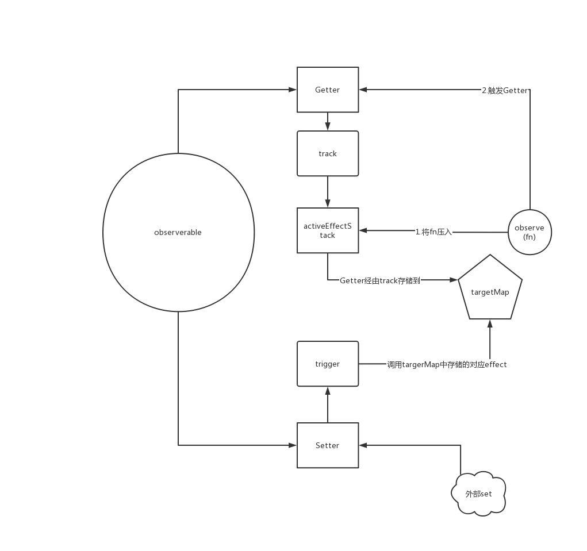

# 缘起

Vue3的响应式有个地方卡住了，听说这个是个五脏全的麻雀，起锅炖了。

# 开始

根据官网的例子：

```javascript
import { observable, observe } from '@nx-js/observer-util';

const counter = observable({ num: 0 });
const countLogger = observe(() => console.log(counter.num));

// this calls countLogger and logs 1
counter.num++;
```

这两个类似Vue3里的reactive和普通的响应式。

这里有一个小思考是counter被Proxy封装之后，为什么countLogger就可以会收集到counter？

只有一种方式就是通过observable里的getter做的添加。

确实如此：

整个执行逻辑是这样的：

1. observable 会为这个观察的对象添加一个handler，在get的handler中有一个`registerRunningReactionForOperation({ target, key, receiver, type: 'get' })`
```javascript
// register the currently running reaction to be queued again on obj.key mutations
export function registerRunningReactionForOperation (operation) {
  // get the current reaction from the top of the stack
  const runningReaction = reactionStack[reactionStack.length - 1]
  if (runningReaction) {
    debugOperation(runningReaction, operation)
    registerReactionForOperation(runningReaction, operation)
  }
}
```

这个函数会获取出一个reaction，并且通过registerReactionForOperation保存。

```javascript
export function registerReactionForOperation (reaction, { target, key, type }) {
  if (type === 'iterate') {
    key = ITERATION_KEY
  }

  const reactionsForObj = connectionStore.get(target)
  let reactionsForKey = reactionsForObj.get(key)
  if (!reactionsForKey) {
    reactionsForKey = new Set()
    reactionsForObj.set(key, reactionsForKey)
  }
  // save the fact that the key is used by the reaction during its current run
  if (!reactionsForKey.has(reaction)) {
    reactionsForKey.add(reaction)
    reaction.cleaners.push(reactionsForKey)
  }
}
```

这里生成了一个set，根据key，也就是实际业务中get时候的key，将这个reaction添加进set中，整个的结构是这样的：

```javascript
connectionStore<weakMap>: {
    // target eg: {num: 1}
    target: <Map>{
        num: (reaction1, reaction2...)
    }
}
```

注意这里的reaction，`const runningReaction = reactionStack[reactionStack.length - 1]` 通过全局变量reactionStack获取到的。

```javascript
export function observe (fn, options = {}) {
  // wrap the passed function in a reaction, if it is not already one
  const reaction = fn[IS_REACTION]
    ? fn
    : function reaction () {
      return runAsReaction(reaction, fn, this, arguments)
    }
  // save the scheduler and debugger on the reaction
  reaction.scheduler = options.scheduler
  reaction.debugger = options.debugger
  // save the fact that this is a reaction
  reaction[IS_REACTION] = true
  // run the reaction once if it is not a lazy one
  if (!options.lazy) {
    reaction()
  }
  return reaction
}

export function runAsReaction (reaction, fn, context, args) {
  // do not build reactive relations, if the reaction is unobserved
  if (reaction.unobserved) {
    return Reflect.apply(fn, context, args)
  }

  // only run the reaction if it is not already in the reaction stack
  // TODO: improve this to allow explicitly recursive reactions
  if (reactionStack.indexOf(reaction) === -1) {
    // release the (obj -> key -> reactions) connections
    // and reset the cleaner connections
    releaseReaction(reaction)

    try {
      // set the reaction as the currently running one
      // this is required so that we can create (observable.prop -> reaction) pairs in the get trap
      reactionStack.push(reaction)
      return Reflect.apply(fn, context, args)
    } finally {
      // always remove the currently running flag from the reaction when it stops execution
      reactionStack.pop()
    }
  }
}
```

在runAsReaction中，会将传入的reaction(也就是上面的`const reaction = function() { runAsReaction(reaction) }`)执行自己的包裹函数压入栈中，并且执行fn，这里的fn即我们想自动响应的函数，执行这个函数自然会触发get，此时的reactionStack中则会存在这个reaction。这里注意fn如果里面有异步代码的情况，try finally的执行顺序是这样的:

```javascript
// 执行try的内容，
// 如果有return执行return内容，但不会返回，执行finally后返回，这里面不会阻塞。

function test() {
    try { 
        console.log(1); 
        const s = () => { console.log(2); return 4; }; 
        return s();
    } finally { 
        console.log(3) 
    }
}

// 1 2 3 4
console.log(test())

```

所以如果异步代码阻塞并且先于getter执行，那么就不会收集到这个依赖。


# 模仿

目标实现observable和observe。

observable和observe应成对出现。

借用Vue3的思路，get时的操作称为`track`，set时的操作称为`trigger`。

先来个导图：



```javascript
function createObserve(obj)  {
    
    let handler = {
        get: function (target, key, receiver) {
            let result = Reflect.get(target, key, receiver)
            track(target, key, receiver)            
            return result
        },
        set: function (target, key, value, receiver) {
            let result = Reflect.set(target, key, value, receiver)
            trigger(target, key, value, receiver)        
            return result
        }
    }

    let proxyObj = new Proxy(obj, handler)

    return proxyObj
}

function observable(obj) {
    return createObserve(obj)
}
```

这里我们只作了一层`Proxy`封装，像Vue中其实做的是一个递归的封装。区别是只做一层封装的话只能检测到外层的`=`操作，内层的如Array.push，或者嵌套的替换等都是无法经过set和get的。

## 实现track

在`track`中我们会将当前触发的`effect`也就是observe的内容或者其他内容压入关系链中，以便`trigger`时可以调用到这个`effect`。

```javascript
const targetMap = new WeakMap()
let activeEffectStack = []
let activeEffect

function track(target, key, receiver?) {
    let depMap = targetMap.get(target)

    if (!depMap) {
        targetMap.set(target, (depMap = new Map()))
    }

    let dep = depMap.get(key)

    if (!dep) {
        depMap.set(key, ( dep = new Set() ))
    }

    if (!dep.has(activeEffect)) {
        dep.add(activeEffect)
    }
}
```

`targetMap`是一个`weakMap`，使用`weakMap`的好处是当我们`observable`的对象不存在其他引用的时候会正确的被垃圾回收掉，这一条链是我们额外建立的内容，原对象不存在的情况下不应该在继续存在。

这里面最终会形成一个

```javascript

targetMap = {
    <Proxy 或者 Object>observeable: <Map>{
        <observeable中的某一个key>key: ( observe, observe, observe... )
    }
}
```

`activeEffectStack`和`activeEffect`是两个用于数据交换的全局变量，我们在get中会把当前的`activeEffect`添加到`get的key的生成的Set`中保存起来，让`set`操作可以拿到这个`activeEffect`然后再次调用，实现响应式。

## 实现trigger

```javascript
function trigger(target, key, value, receiver?) {
    let depMap = targetMap.get(target)

    if (!depMap) {
        return
    }

    let dep = depMap.get(key)

    if (!dep) {
        return
    }

    dep.forEach((item) => item && item())
}
```

trigger这里按照思路实现一个最小的内容，只是将get中添加的`effect`逐个调用。

## 实现observe

根据导图，在`observe`中我们需要将传入的`function`压入`activeEffectStack`并调用一次function触发`get`。

```javascript
function observe(fn:Function) {
    const wrapFn = () => {

        const reaction = () => {
            try {
                activeEffect = fn     
                activeEffectStack.push(fn)
                return fn()
            } finally {
                activeEffectStack.pop()
                activeEffect = activeEffectStack[activeEffectStack.length-1]
            }
        }

        return reaction()
    }

    wrapFn()

    return wrapFn
}
```

function有可能出错，finally中的代码保证activeEffectStack中对应的那个会被正确删除。

## 测试

```javascript
let p = observable({num: 0})
let j = observe(() => {console.log("i am observe:", p.num);)
let e = observe(() => {console.log("i am observe2:", p.num)})

// i am observe: 1
// i am observe2: 1
p.num++
```

## 实现computed

在Vue中一个很有用的东西是计算属性(computed)，它是依赖于其他属性而生成的新值，会在它依赖的其他值更改时自动更改。


我们在实现了ovserve之后computed就实现了一大半。

```javascript
class computedImpl {
    private _value
    private _setter
    private effect

    constructor(options) {
        this._value = undefined
        this._setter = undefined
        const { get, set } = options
        this._setter = set

        this.effect = observe(() => {
            this._value = get()
        })
    }

    get value() {
        return this._value
    }

    set value (val) {
        this._setter && this._setter(val)
    }
}

function computed(fnOrOptions) {

    let options = {
        get: null,
        set: null
    }

    if (fnOrOptions instanceof Function) {
        options.get = fnOrOptions
    } else {
        const { get, set } = fnOrOptions
        options.get= get
        options.set = set
    }

    return new computedImpl(options)
}
```

computed有两种方式，一种是`computed(function)`这样会当做get，另外还可以设置setter，setter更多的像是一个回调可以和依赖的其他属性完全没有关系。

```javascript
let p = observable({num: 0})
let j = observe(() => {console.log("i am observe:", p.num); return `i am observe: ${p.num}`})
let e = observe(() => {console.log("i am observe2:", p.num)})
let w = computed(() => { return '我是computed 1:' + p.num })
let v = computed({
    get: () => {
        return 'test computed getter' + p.num
    },

    set: (val) => {
        p.num = `要你命${val}`
    }
})

p.num++
// i am observe: 0
// i am observe2: 0
// i am observe: 1
// i am observe2: 1
// 我是computed 1:1
console.log(w.value)
v.value = 3000
console.log(w.value)
// i am observe: 要你命3000
// i am observe2: 要你命3000
// 我是computed 1:要你命3000
```
